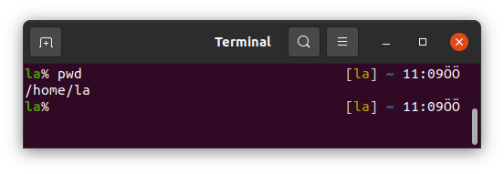
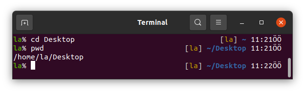
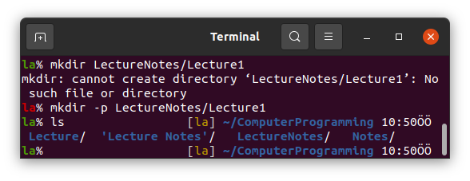

# Lecture 2 (14.10.2022)
### Basic Terminal Commands on Ubuntu
Open a Terminal Window by
* pressing `Windows Key` and typing `Terminal`,
* pressing `ctrl+alt+t`,
* or clicking the Terminal Icon on the left dock.

### 0. Use of terminal by the keyboard
You cannot use mouse on the terminal. But sometimes we can write a long command with a typo and need to go left and fix it. You can use
* `ctrl+b` to go to the left letter by letter,
* `ctrl+a` to go to the left-most first character,
* `ctrl+f` to go to the right letter by letter,
* `ctrl+e` to go to the right-most last character.

### 1. `pwd`
`pwd` stands for `Print Work Directory` in Linux. 
Terminal opens at the `home` directory by default in Ubuntu.
If you type `pwd` and press `Enter` you will see your `home` directory.

in my case.

### 2. `ls`
We can list the files and folders in a directory using this command.

Shows the files and folders located in your `/home/la` directory.
You should see the same folders in your `home` directory
if you followed [this repository](https://github.com/laydinbakar/Computer_Programming_BTU/blob/main/00_ubuntu_installation.md) to install Ubuntu on your computer or if you use one of our lab computers.

`ls` also has some options with it. One of them is `ls -l` which prints the details of the files such as the size of a file in KB and the date that the file has been created.

The other is `ls -la` and used for printing also the hidden files starting with `.` in your working directory.

### 3. `cd`
`cd` stands for `Change Directory` in Linux.
We can go to a directory using the `cd` command as shown below.

This usage of `cd` lets we go to a directory relatively your working directory.
It can also be used as absolute path.

We can use `cd` alone in commandline to go to `home` directory.

`..` "two dots without space" is used to go an upper directory. Here we are in `/home/la`. Typing `..` we can go to `/home` directory.

`~` which is tilde is equal to `/home/la` in Linux Terminal. 

### 4. `mkdir`
`mkdir` is the acronym of `Make Directory`.
We can make directories using this command.

If we use space between two word when we make directories using `mkdir` it makes two different folders.

So, if we want to make a directory so called "Lecture Notes" we should type

but this way is usually not preferred by Linux users. Instead we use `Lecture_Notes` or `LectureNotes`. For the differences you can read [here](https://wiki.c2.com/?UnderscoreVersusCapitalAndLowerCaseVariableNaming).

If we need to make multiple directories, such as `LectureNotes/Lecture1` we can use `mkdir`.
However, if any of the non-existing directories included in our command, we get an error.
To get rid of this error we should use `-p` option as follows.

This will both make the `LectureNotes` directory and `Lecture1` in it.

### 5. `touch`
This is a command creating files in Linux.

First go to the `LectureNotes` directory and follow the instructions.

### 6. `rm`
`rm` removes files in Linux. But we cannor remove folders using `rm` alone.

We need to use `-r` option to remove folders or `-rf` option so as not to get error for non-existing files and arguments.

### 7. `cp`
`cp` is acronym of `Copy` in Linux Terminal. A `-r` option is used with `cp` for similar reasons.

### 8. `ln -s`
`ln -s` stands for `Link`. We can use this to link a file or folder to somewhere else.

We can also link a folder.

### 9. `mv`
`mv` stands for `move`. We can move files and folders using `mv`.

  
### 10. `gedit`
`gedit` is the command to open the Ubuntu's default text editor Gedit. We can open some files using it change and save.

The file editor is opened immediately and you can write on it.

Then to close the text editor and back to the terminal window you can use `ctrl+s` to save, `ctrl+w` to close the document editing and once more `ctrl+w` to close Gedit. As an other way to close it, press `ctrl+s` to save and go back to the terminal and press `ctrl+c`.

`Please note that` we will not use Gedit to edit our files. We will use Vim which will be taught in the following lectures. This information is given here to write some files before learning Vim.

### 11. `cat`
You can write `gedit file.txt` to open the file again or you can use `cat` command to see what is in the file without leaving the terminal window.

We can also use `cat` to combine files. To do that first open another file as `file2.txt` using Gedit and write something in it. Save and exit.

Now use `cat` to write what is included in `file.txt` into `file2.txt` and check it.

### 12. `echo`
We use `echo` to print anything on the command line.

We can also use `echo` to write something into a file. Try the following.

If the file does not exist, we should use single `>` instead of `>>`.

