# Lecture 4 (28.10.2022)
You can watch the video lectures for
* [Python]().

## Introduction to Python Programming Language
### Basic arithmatic operations
|Sign |Name |Ex |Results |
|------|------|------|------|
|`+`| Addition| 7+3 |10|
|`-`| Substraction| 7-3|4|
|`\*`| Multiplication|7\*3|21|
|`/`| Division|7/3|2.3333|
|`%`| Modulo|7%3|1|
|`**`|Exponentiation|7\*\*3|343|

### Python in the commandline
Python can be used in the commandline by typing `python` (or `python3` for 3rd version of Python).

You can try the arithmetic operations above in the commandline Python and press `ctrl+d` or type `exit()` to exit.

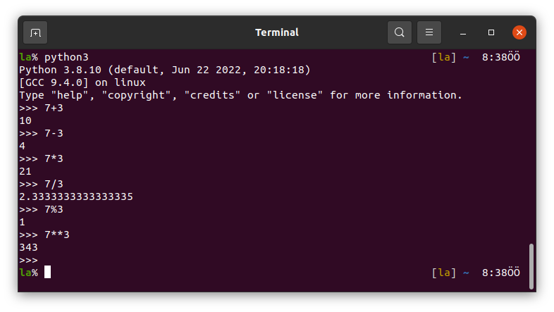

To write the output of the commandline Python into a file use `python3 > file` command.

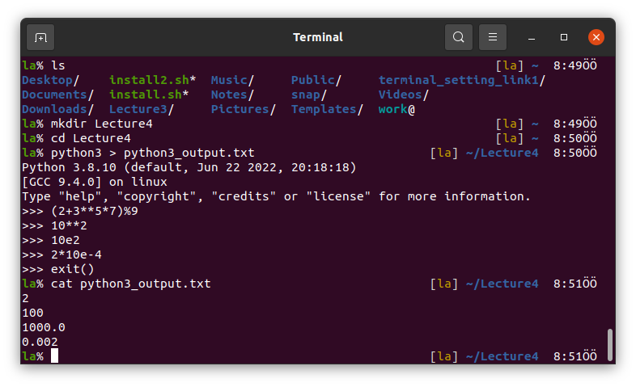

Or you can both see the results in commandline Python and write into a file by `python3 | tee file`. Try it.

### Python in Vim
To see clearer you can start using Screen here `screen -S lecture4`.

Open a file with `.py` extension `vi firstPythonCode.py`. 

### `print` in Python
Use `print("")` command to print out.

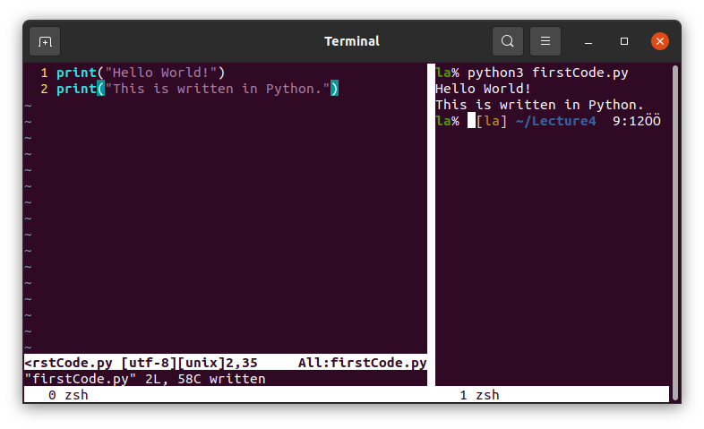
 
### `input` in Python
You can ask user to type something when it runs the code.

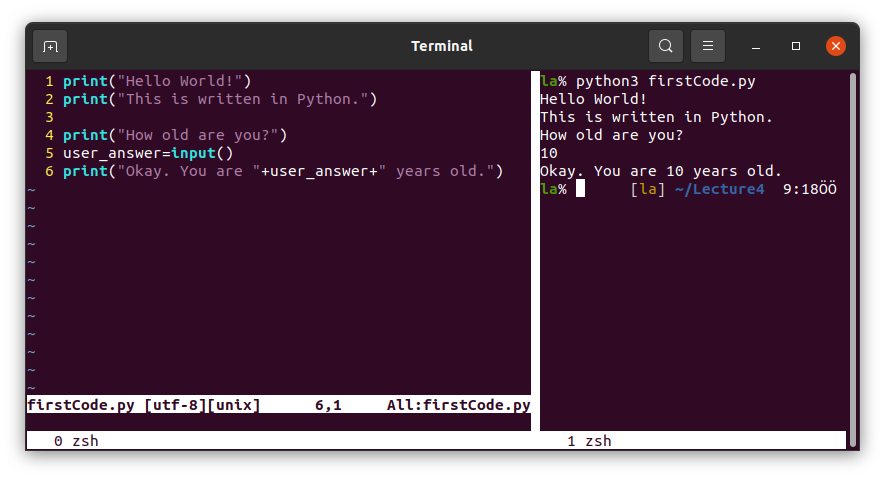

### Basic data types
Integer, floating-point numbers, strings and boolean are the four data types in python.

See for integers and floats for example:

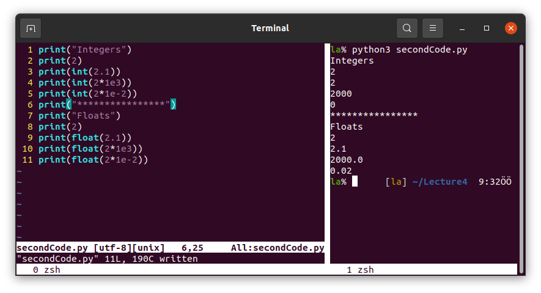

and for strings and booleans:

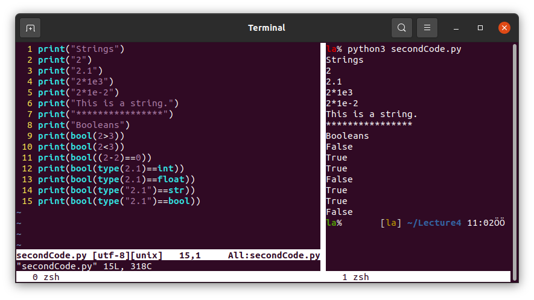

### Variables

We can define variables as follows:

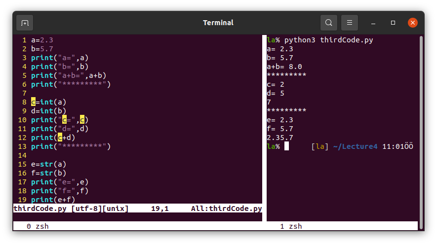

We can also ask variables to the user with `input()`. But the input is in string type as default. If we use it as integer, float or boolean we should express it.

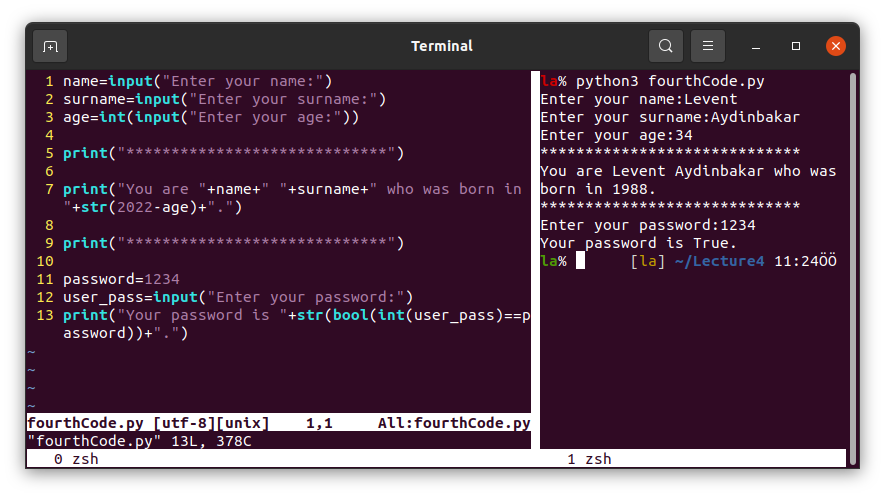

## Lists in Python Programming Languange
### Makiing lists
You can make lists in Python as follows:

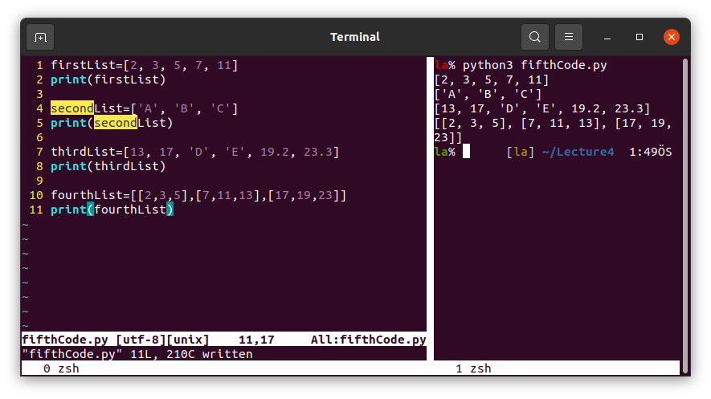

### Use the lists
Read an item in a list and make operations.

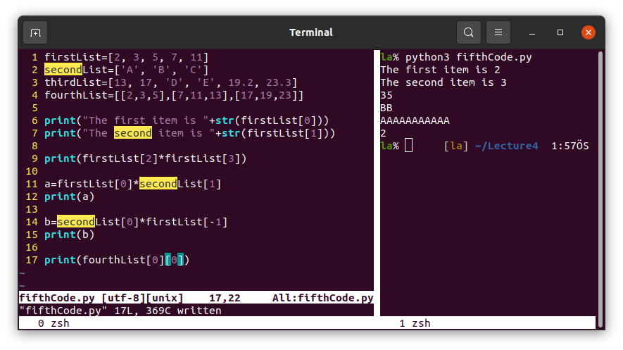

Read multiple vaules from lists.

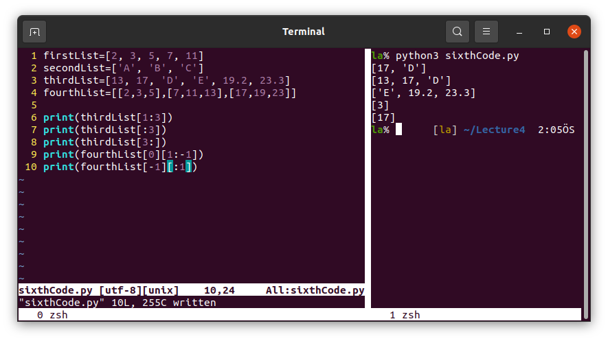

You can manipulate items of lists.

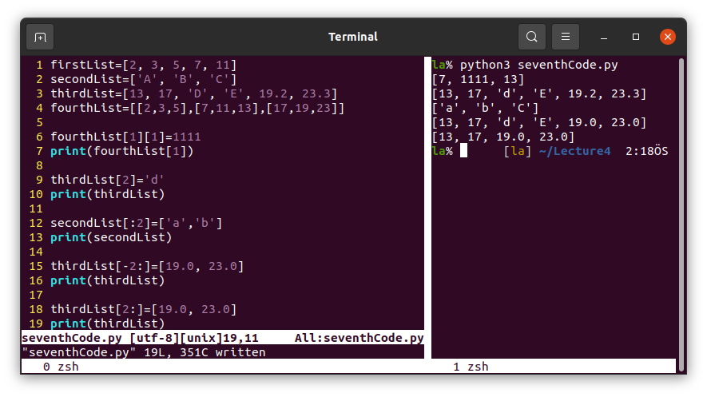

Find some useful list methods below.

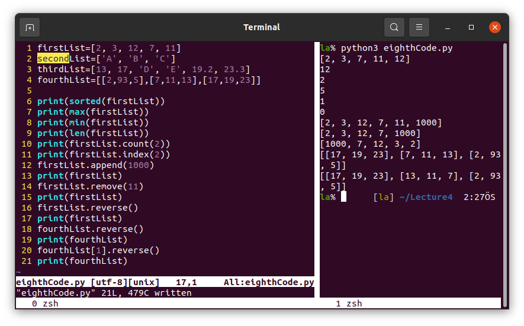

### String methods

Similar methods are also available for strings.

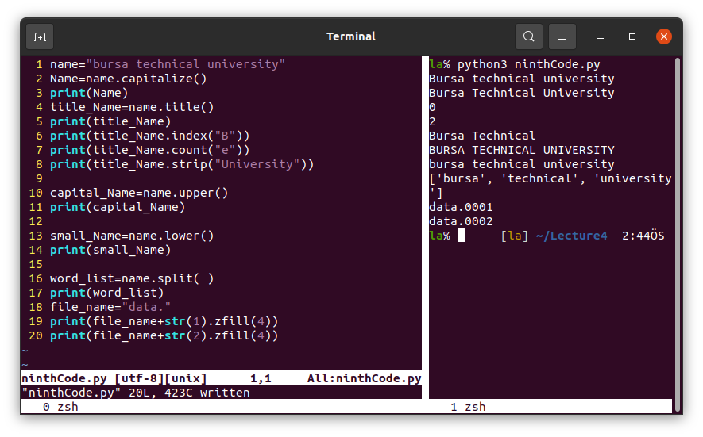

# Upload your codes on GitLab
You signed up GitLab last week. Open that repository on your web browser and copy its link.

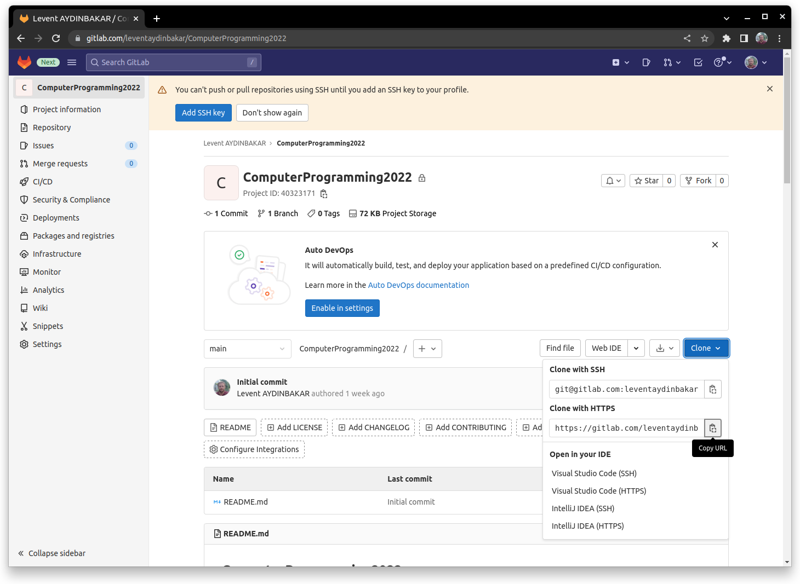

Open the terminal and use `git clone` command to download the repository onto your computer.

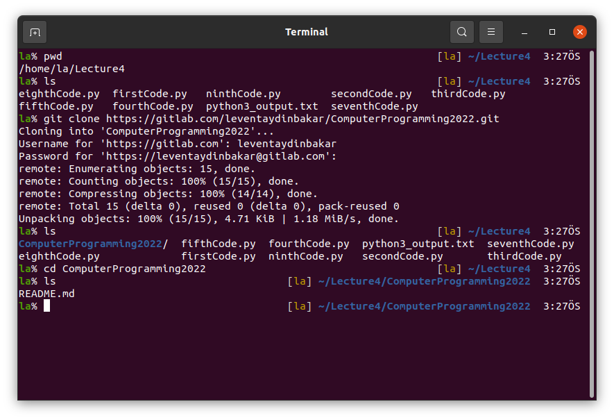

`cd` to `ComputerProgramming2022` folder and make some changes as follows.
* Make `Lecture4` and `MidtermExam` folders. Be careful about the names and capitalization. Do exactly the same as `Lecture4` and `MidtermExam`.
* Move all the scripts you write from `../` to `Lecture4`.
* Empty folders cannot be uploaded onto GitLab repositories. Use touch to add `README.md` files in each folders.
* Check if you do all correctly by `ls *`.

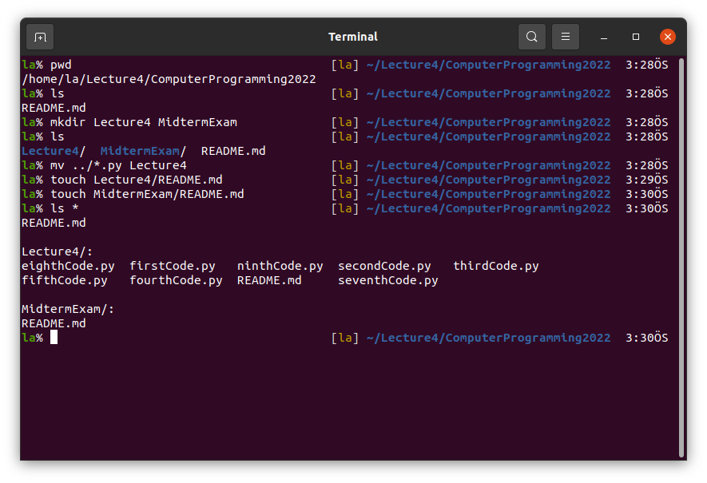

Then, add all the Python scripts you have written today onto your GitLab repository. Use 
* `git add .`, 
* `git commit -m "Add files"` and 
* `git push origin main` commands, respectively.

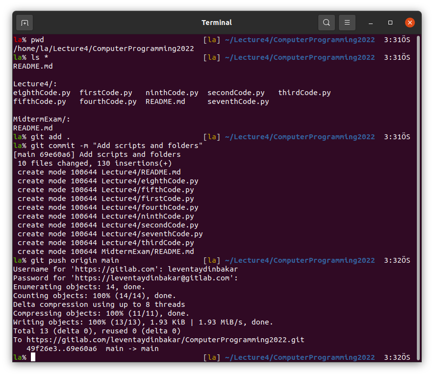

At the end, you can check your GitLab repository from your browser.

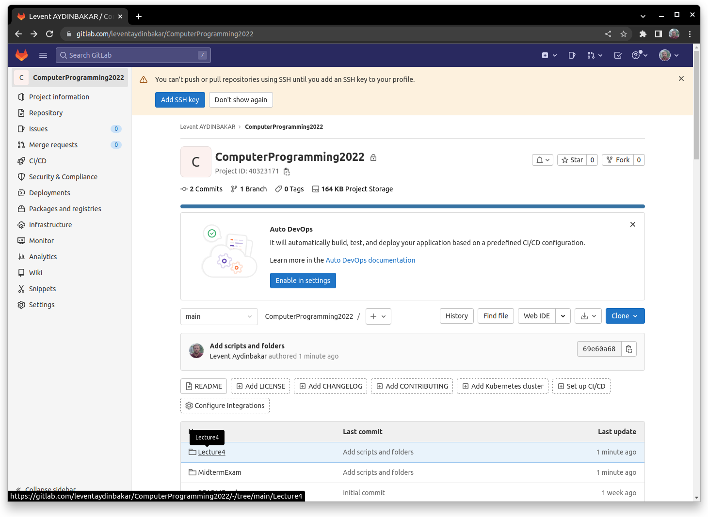

