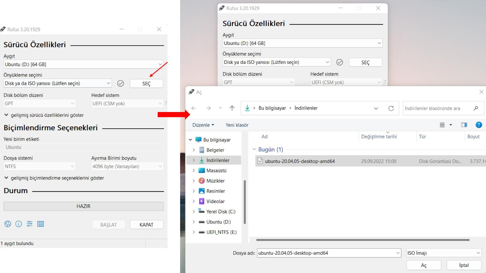

# Computer Programming
## Installation of Ubuntu
### Download of Ubuntu
To download Ubuntu, type Ubuntu Download into google search button or click [This Link](https://ubuntu.com/download/desktop).
After, you will see the download page. 
At this page, there is a button for download the Ubuntu 22.04.1 LTS. 

However, we will use the Ubuntu 20.04 LTS in our courses. 
In the version we will use, the first two numbers are important. So I mean Ubuntu 20.04. Please note that there are numbers 20 and 04 here. The number after these numbers is not important.
To download Ubuntu 20.04, click on the button that says "see our alternative downloads" as given below.

Download the Ubuntu 20.04 iso file by clicking the button as shown in the figure below. (Download via BitTorrent as the file size is too large.) 

### Download of Rufus
Rufus is a tool for Windows that lets you create boot devices from external storage units, like USB flash drives and SD cards. Its versatility lets you format a new drive, as well as install Linux, Windows, and even FreeDOS disk images, which, in fact, comes built into the application itself.

We need to write the Ubuntu iso file to a flash drive. So we will create an image file. For this we need to download the Rufus.
Type "Download Rufus" in the google search button or click [This Link](https://rufus.ie/en/) to download Rufus.
After, download Rufus to your computer as shown in the image below.

Run Rufus and write your Ubuntu 20.04 iso file to your flash memory as in the image below. (Make sure your flash memory is at least 15GB.)

After using Rufus to make an ISO image into a USB drive, you can restart your computer and press your boot key.
In the boot screen of your computer, you will see a similar page as given below.

