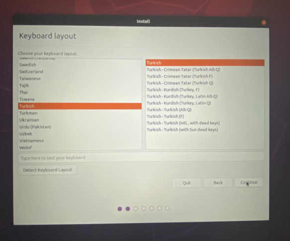

# Computer Programming
## Installation of Ubuntu
### Download of Ubuntu
To download Ubuntu, type Ubuntu Download into google search button or click [This Link](https://ubuntu.com/download/desktop).
After, you will see the download page. 
At this page, there is a button for download the Ubuntu 22.04.1 LTS. 

However, we will use the Ubuntu 20.04 LTS in our courses. 
In the version we will use, the first two numbers are important. So I mean Ubuntu 20.04. Please note that there are numbers 20 and 04 here. The number after these numbers is not important.
To download Ubuntu 20.04, click on the button that says "see our alternative downloads" as given below.

Download the Ubuntu 20.04 iso file by clicking the button as shown in the figure below. (Download via BitTorrent as the file size is too large.) 

### Download of Rufus
Rufus is a tool for Windows that lets you create boot devices from external storage units, like USB flash drives and SD cards. Its versatility lets you format a new drive, as well as install Linux, Windows, and even FreeDOS disk images, which, in fact, comes built into the application itself.

We need to write the Ubuntu iso file to a flash drive. So we will create an image file. For this we need to download the Rufus.
Type "Download Rufus" in the google search button or click [This Link](https://rufus.ie/en/) to download Rufus.
After, download Rufus to your computer as shown in the image below.

Run Rufus and write your Ubuntu 20.04 iso file to your flash memory as in the image below. (Make sure your flash memory is at least 15GB.)

### Installation
After using Rufus to make an ISO image into a USB drive, you can restart your computer and press your boot key.
In the boot screen of your computer, you will see a similar page as given below.  (If you don't know which key (F12, F11 etc.) is used on your keyboard for "boot manager", search it on google with your computer model.)

From the boot menu that appears, select the USB driver where you writed the iso file by the rufus.
After selecting the USB drive, you will see a screen similar to the one below. 

Continue here by selecting the English language option and clicking Install Ubuntu button.

Then choose your keyboard layout as in the image below. (Choose English if you have an English keyboard layout.)

Then you will see a screen like the below. Continue to the installation by clicking the "Normal installation" and Download updates while installing ubuntu" options as in the image.

On the next step, as shown the below, click "Install Ubuntu alongside Windows Boot Manager" as the installation type and continue.

In the next step, you will see a screen like the one below.

Allocate at least 30 GB of space which we will need in the lessons for Ubuntu. (You can boost this area further if you prefer.)
To allocate disk space, pull the bidirectional arrow to the right or left.

In the next step, you will see the location selection section as in the image below. Select your location by typing Turkey or Istanbul here.

In the next step, you will see a screen with information such as username, password and computer name as below.

While we are working on Ubuntu, we will have to use passwords many times. Because most of the operations we will do will require a password in the terminal. So set a password that is both strong and fast to type. (Please be careful not to use Turkish characters in all your steps.)

Then wait for some time the installation to complete as in the picture below.

When the installation is complete, you will see a screen like the picture below. Please do not remove the USB drive during this time and click the restart button. 

After restart, you will then see a screen like the image below.

Remove the USB driver and then press the enter. 
After this step, wait for the computer to start.

When the computer starts, you will see a screen like the image below. 

Here, select the "Ubuntu" partition to boot your computer with Ubuntu, or the partition starting with "Windows Boot Manager" to boot your computer with Windows. 

### Updating and Installing Required Applications

After you complete the installation cleanly, watch the video below. 

This video includes some other system updates and installation of useful applications such as web browser in the first stage.

Then watch the second video below.

This video contains the programs we will use in the lessons and some terminal settings. The folders and files in the video will be shared with you via the google drive.
