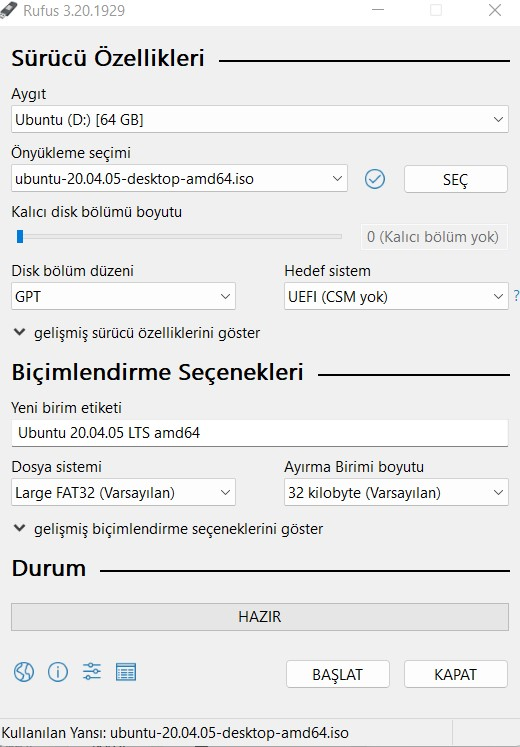
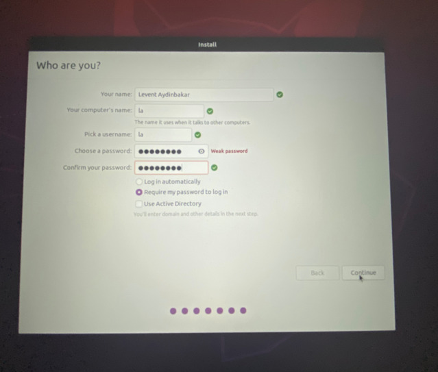
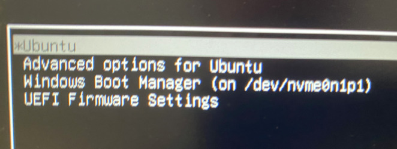
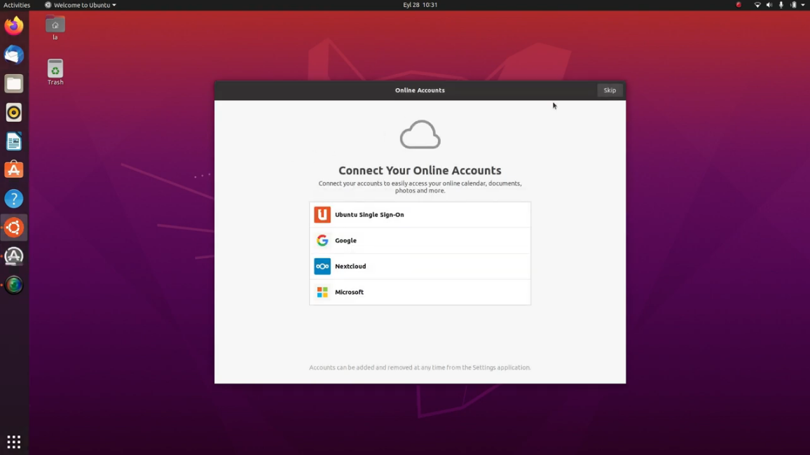
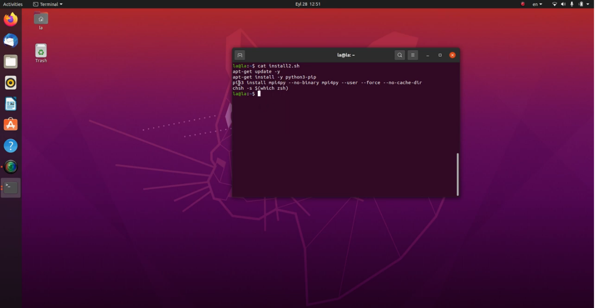

## Installation of Ubuntu
### Download
In this course, we use the Ubuntu version of 20.04.5 LTS. 
You can download the version 20.04 LTS (Focal Fossa) for free from [this link](https://ubuntu.com/download/alternative-downloads), under `Past releases and other flavours` section seed on the right bottom corner.

An ISO file will be downloaded.

### Download Rufus
We need to write the Ubuntu ISO file to a flash drive using Rufus.
Use [this link](https://rufus.ie/en/) to download Rufus.

Run Rufus and write your Ubuntu 20.04 iso file to your flash memory as in the images below.

### Installation
After using Rufus to make an ISO image into a USB drive, you can restart your computer and press your boot key.
If you don't know which key (F2, F10, F12, F11 etc.) is used on your keyboard for boot manager, search it on Google with your computer model.
In the boot screen of your computer, you need to change boot option to your USB.
Here you should search on the internet how to change the boot option in your computer model because it changes by the model.
You can find a boot manu screenshot taken on a Lenovo computer.

After selecting the USB drive, you will see a screen similar to the one below. 

Click `Install Ubuntu` button. Then choose your keyboard layout as in the image below. (Choose English if you have an English keyboard layout.)

Continue to the installation by clicking the `Normal installation` and `Download updates while installing Ubuntu` options as in the figure below.

# VERY IMPORTANT STEP
If you choose wrong you might remove everything on your Windows side. Be careful.

Click 

`Install Ubuntu alongside Windows Boot Manager` 

as the installation type and continue.

In the next screen, allocate at least 30 GB of space (a larger space pereferable) which we will need in the lessons for Ubuntu. 
To allocate disk space, pull the bidirectional arrow to the right or left.

Select your location here.

You will see a screen with information such as username, password and computer name as below.
We recommend you to choose a short computer and user names (e.g. la here) and easy-to-type password (e.g. fjfjfjfj) here.

Then wait for some time the installation to complete as in the picture below.

When the installation is complete, click the `Restart Now` button. 

After restart, you will then see a screen like in the image below.
Remove the USB driver and then press the `Enter`. 

When the computer starts, you will see a screen like in the image below. 

Here, you can select the `Ubuntu` to open Ubuntu, or `Windows Boot Manager` to open Windows. 
If you do not press `Enter` here for 10 seconds Ubuntu starts as default.
You can change this order, to make Windows your default OS. For this, you can find information [here](https://itsfoss.com/grub-customizer-ubuntu/).

### Updating and Installing Required Applications

After you complete the installation, watch three videos below. 
_Click on the pictures_ to go to YouTube to watch the videos.

The first video includes some other system updates and installation of useful applications such as web browser in the first stage.

Then watch the second video below.
This video contains the programs we will use in the lessons and some terminal settings. 
The folders and files in the video will be shared with you via a Google Drive shared folder.

And the last video shows some more settings.

