# Lecture 3 (21.10.2022)
You can watch the video lectures for
* [Vim](https://youtu.be/WTTno8TSvIw) and
* [Screen and GitLab](https://youtu.be/QkrVu39wjus).

## Vim
Vim is a text editor can be used on the terminal window.

It is usually used to make coding process faster.

Let's make `Lecture3` directory on your `home` directory and create three empty files in it.

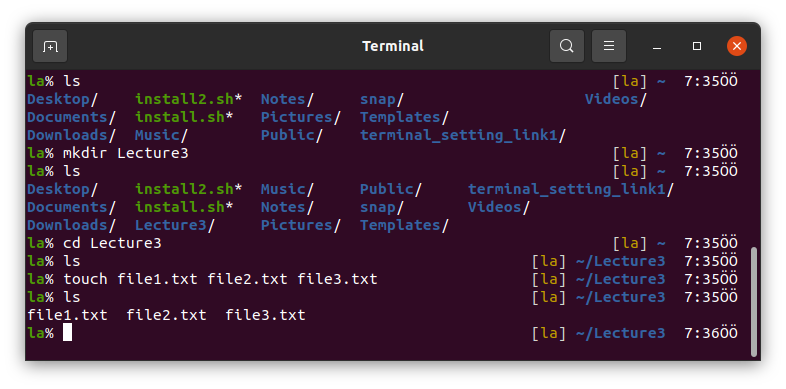

You can open `file1.txt` via `vi file1.txt` or `vim file1.txt` command.

Vim is an improved version of Vi. The differences between those are not important for this course.

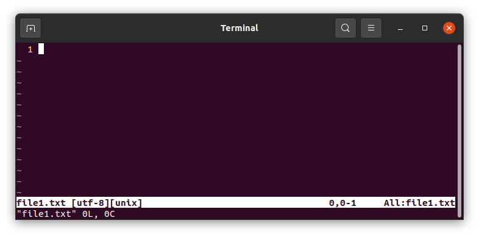

In Vim, there are three modes, 
* `command` mode,
* `insert` mode, and
* `visual` mode.

### `insert` mode
Press `i` for the `insert` mode to start writing on the document.
When you press `i` you will see on the bottom-left corner that `-- INSERT --` will be printed out.

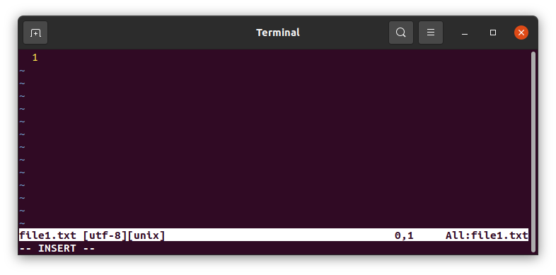

Type something and press `ESC` to open the `command` mode.

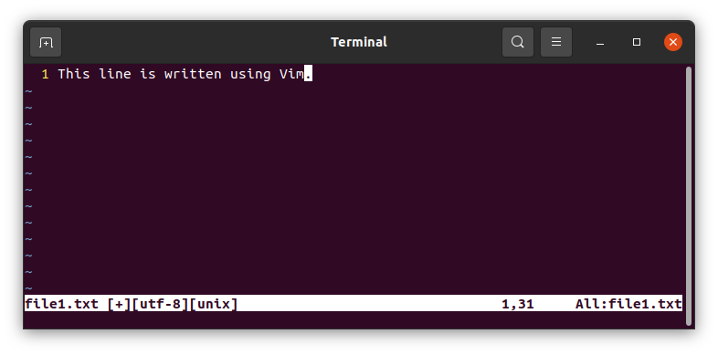
  
### `command` mode
After pressing `ESC` you can type 
* `:w` for saving the document but not exiting,
* `:wq` for saving and exiting from it,
* `:q` for not saving but exiting,
* and add `!` at the end of these commands for forcing Vim to do what you ask.
Try these options by yourself.

Later open the saved document again using Vim.

### `insert` mode again
It will open in `command` mode. You can press 
* `i` to start typing where the cursor is,
* `shift+i` to start typing at the beginning of the line where the cursor is,
* `a` to start typing one character right from where the cursor is,
* `shift+a` to start typing at the end of the line where the cursor is,
* `o` to start typing one line below from where the cursor is.
* `shift+o` to start typing one line above from where the cursor is.
Try these options by yourself.

Press `o` and type something.

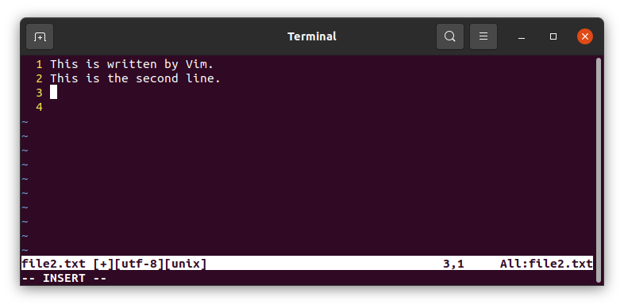

You can press `Enter` for the next line in the `insert` mode.

### Undo and Redo
In the `command` mode, you can undo your changes or redo by pressing `u` and `ctrl+r` respectively.

### Move the cursor on the text

In the `command` mode, you can move on the text using,
* `k` to above (or upper arrow),
* `j` to below (or lower arrow),
* `l` to the right (or right arrow),
* `h` to the left (or left arrow),
for one character (or line).
To move word-by-word, you can use
* `b` to the left,
* `e` to the right.
These commands can also be used with numbers.
* `10k` moves the cursor 10 lines above,
* `3j` moves to cursor 3 lines below,
* `5l` moves it 5 characters right and so on.
Moreover, you can move by pressing,
* `shift+g+g` to the last character of the document,
* `g+g` to the first character.
Specially, `0` (zero) moves to the first character of the line.

### Select and copy or cut
You can select, in Vim `command` mode
* a line using `shift+v`,
* or a character using `ctrl+v`.
After selecting whatever you want to copy, press `y` to copy
or press `x` to cut.
Then move whereever you want to paste and press `p`.

### Working on multiple files
In the `command` mode, you can open multiple files
* using `:split filename` horizontally divided or
* using `:vsplit filename` vertically divided.

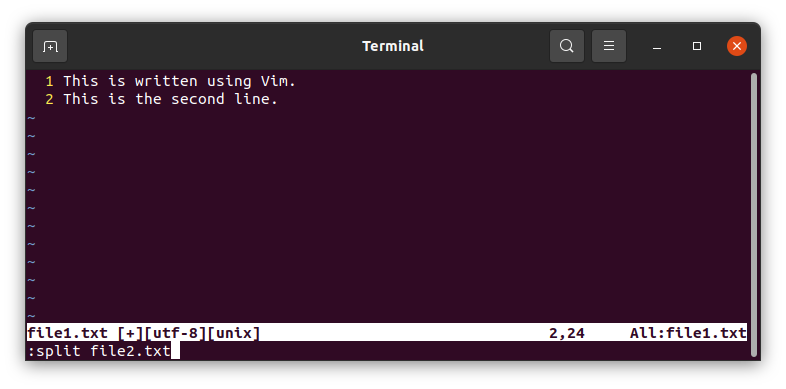

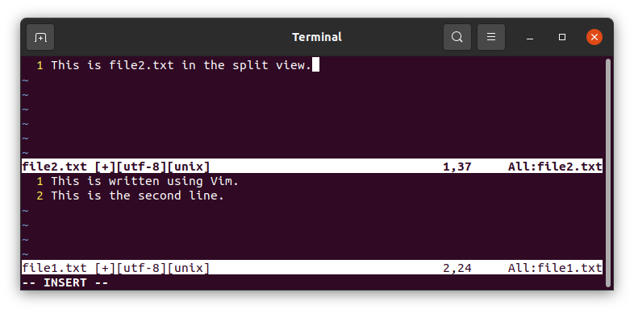

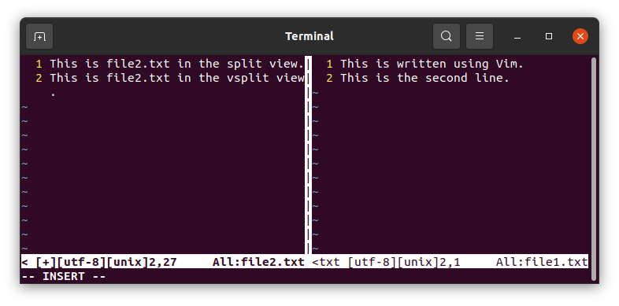
  
In the `command` mode, it is possible to move between files by pressing `ctrl+w+w`
 
You can save files and exit with `:wq` in the `command` mode or you can use `:wqall` to save all and exit from all files.

Other way to open files in split mode is opening them together from terminal commandline.

Here `-o` option splits view horizontally and (capital) `-O` splits it vertically.

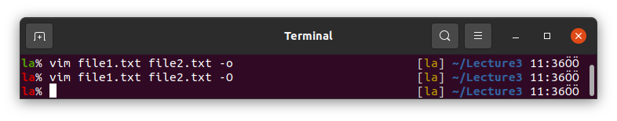

You can split the views more typing more file names in the commandline or using `:split file3.txt` for example in the `command` mode.

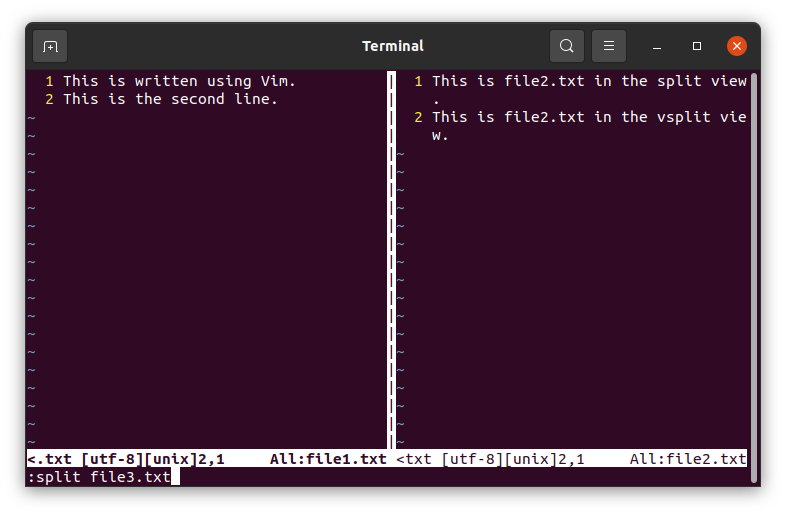

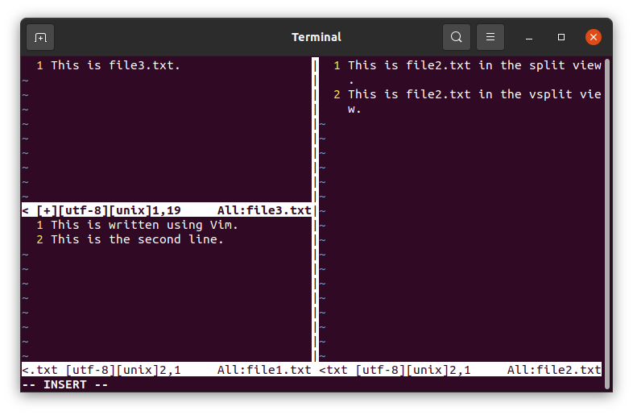

### Hidden recovery files
If you press `ctrl+z` when you are in `command` mode, Vim will immediately close and recovery files will be written.

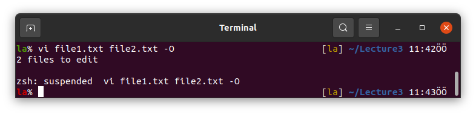

If you want to open those files back you will see a window as follows.

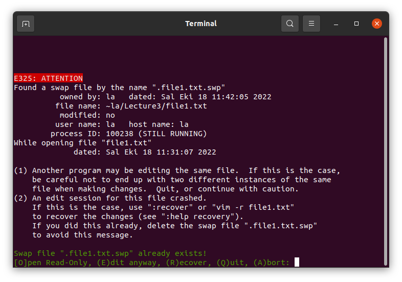
  
Here you can choose what to do,
* press `e` to continue editing. In this case you will not be able to see the last changes,
* press `r` to continue editing with the last changes,
* press `q` to quit,
* press `a` to abort.

I do not use `ctrl+z` when I use Vim. If I do it accidentally, I just remove the hidden files to get rid of this warning.

### Settings
You can personalize Vim according to your needs.

Some of the settings are listed below.
* `:set number` opens the line numbers on the left side.
* `:set nonumber` closes them.
* `:set mouse=a` allows you to use your mouse to move the cursor (not recommended).
* `:set mouse=c` disables it.
* `:set relativenumber` shows the line numbers relative to where you type.
* `:set norelativenumber` shows absolute line numbers.

You can set these in the `command` mode but the changes will not be applied in the later sessions.
To apply them for later add your favourite settings into `~\.vimrc` file. 

### Running terminal commands in Vim
`:! command` allows you to run terminal commands without leaving Vim.
Try to do following simple Python example.

Open `firstPythonCode.py` file using Vim.


Write the simple code `print("Hellow World!")` and save with `:w`.

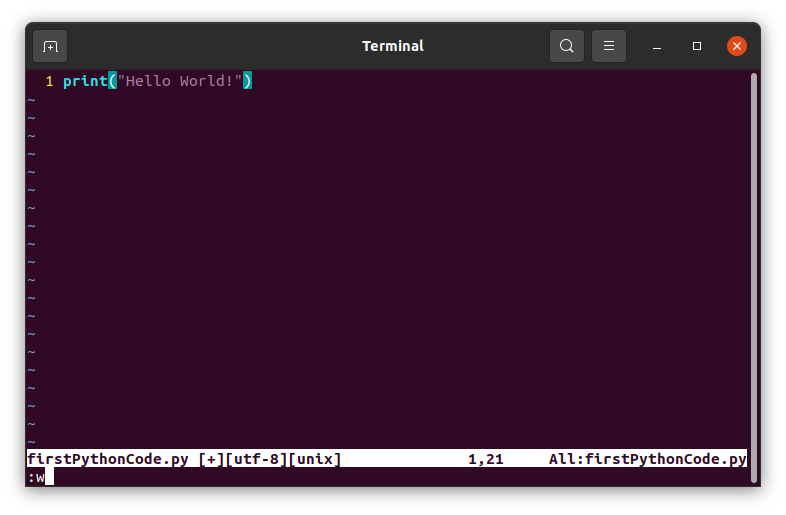

Use `:! python3 firstPythonCode.py` to run the code in the `command` mode.

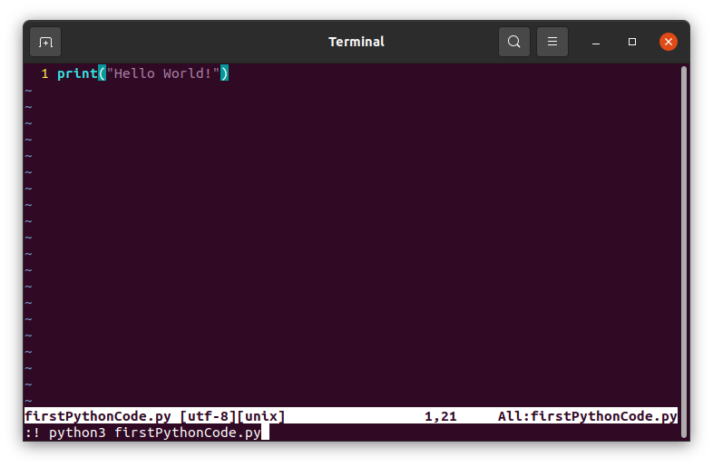

Check the output.


## Screen
Screen is used to run terminal commands in the background, divide the terminal window and use multiple terminals on one window. 

You can start screen by typing `screen` on the commandline.

### Split
Then divide your window vertically by `ctrl+z` and `|`.

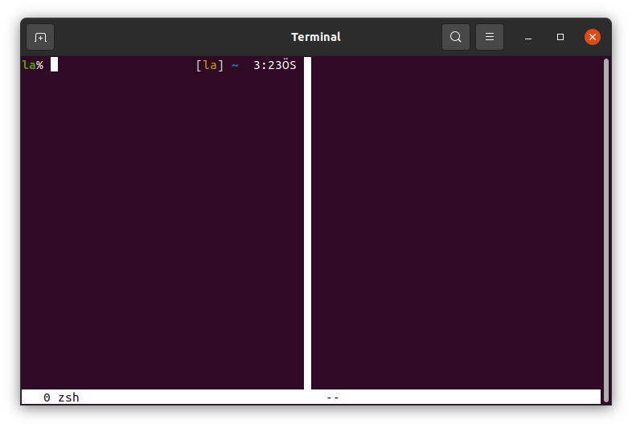

And/or divide your window horizontally by `ctrl+z` and `shift+s`.

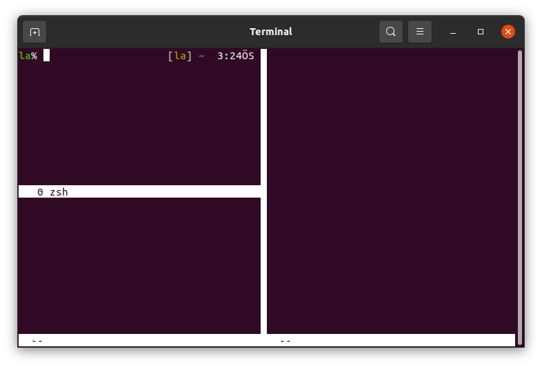

### Move
Press `ctrl+z` and `tab` for jumping to the next half, or `ctrl+z` and `shift+tab` for the previous half.

`ctrl+z` and `c` opens new terminal on the current half. You can see the numbres at the bottom-left corner of each space.

Or you can print all the terminal numbers by pressing `ctrl+z` and `w`.

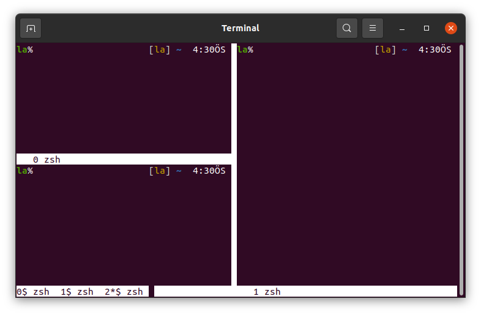

You can change the active terminal by `ctrl+z` and `space`.

### Resize
You can change the size of any split using `ctrl+z` and `:resize` and the number of characters (horizontally) or lines (vertically).

In the below example `ctrl+z` and `:resize 7` is used for the terminal number 2 and `ctrl+z` and `:rezie 25` is used for the terminal number 1.


To cancel all the splits and focus on only one screen you can press `ctrl+z` and `shift+q`.

The other screens are not killed with this. You can see it with `ctrl+z` and `w`.

You can change see the active terminal with `ctrl+z` and `w`. There is `*` near to the terminal number.

To change the active terminal here, you can again use `ctrl+z` and `space`. Other ways to change the active terminal are listed below.
* `ctrl+z` and `number` of the terminal you want to activate, and
* `ctrl+z` and `"` to list the terminals and choose one of those with the arrow keys (or k to above j to below).

### Name the Screen windows
When you press `ctrl+z` and `"`, you will see that all the screens are named as `zsh` as default. 

You can change it by pressing `ctrl+z` and `shift+a`, then deleting `zsh` and writing the new name.

In the below picture, the names are changed and shown by pressing `ctrl+z` and `"`.

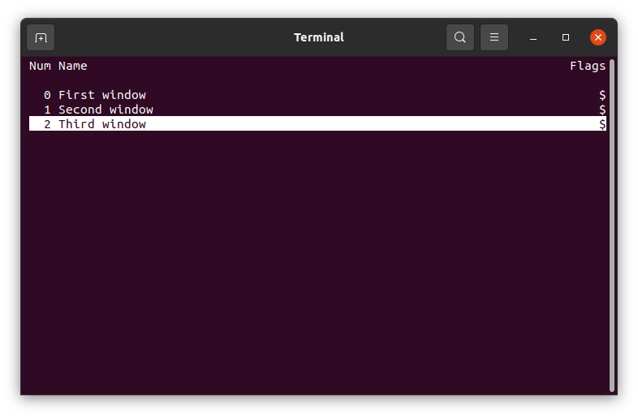

You can also see the changes when you split your terminal window vertically into 3 for example by pressing `ctrl+z` and `|` two times.

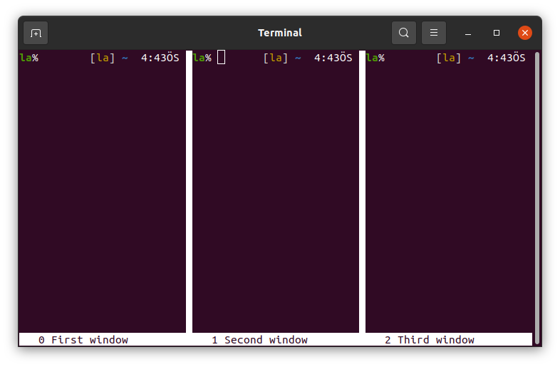

### Kill a Screen window
Here you can kill a window by pressing `ctrl+z` and `k`. It asks you to press `y` if you are sure to kill that window.

You can kill all the windows in this Screen session by `ctrl+z` and `\`.

### Name, detach and attach
`screen -S name` is the command to give a name to a Screen session.

Use `ctrl+z` and `d` to detach from a Screen session.

Use `screen -r name` to reattach to the Screen session.

You will notice that working jobs continue working even we detach from a screen.

# GitLab
We can share our codes or any data using GitLab, work on the projects as a team or make a program public.

### Sign up GitLab
Students in this course are required to open their own GitLab account with the specific user names as the details are given below.

To sign up GitLab, click [this link](https://gitlab.com/users/sign_up) and fill the form.
# `IMPORTANT`
Your username has to include your student number, name and surname (with English characters) as `123456789_levent_aydinbakar`, for example

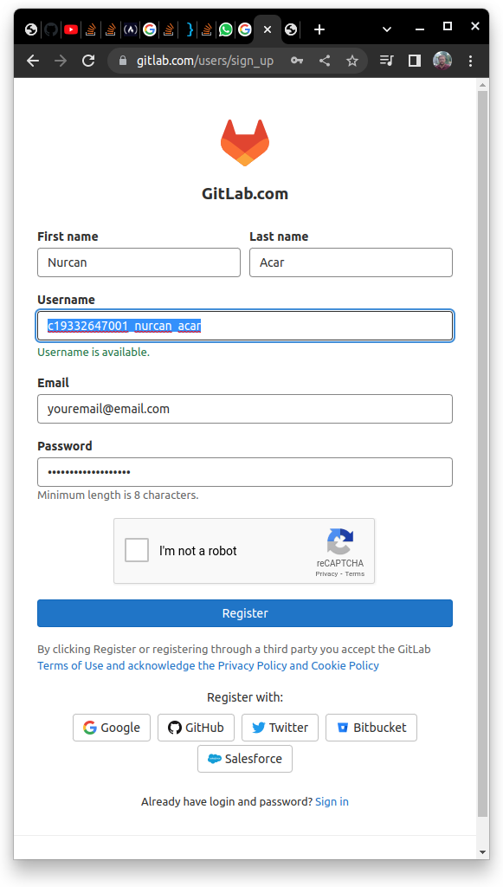

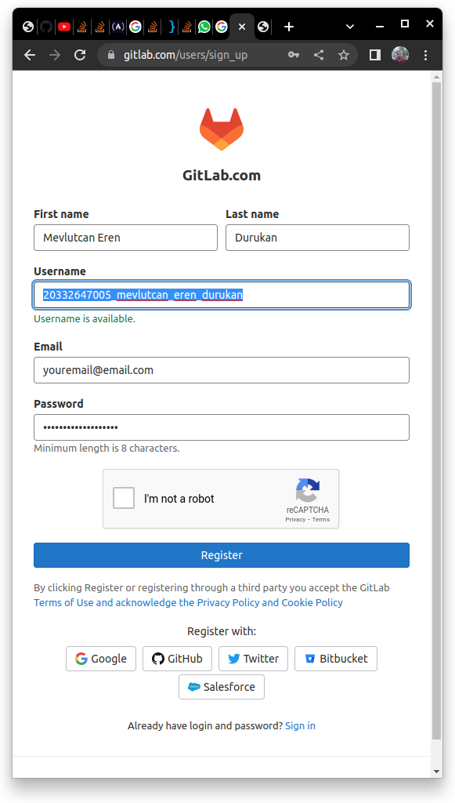


### Create a project
After signing up GitLab, create your project as `ComputerProgramming2022` by clicking on [this link](https://gitlab.com/projects/new#blank_project) following the example below.

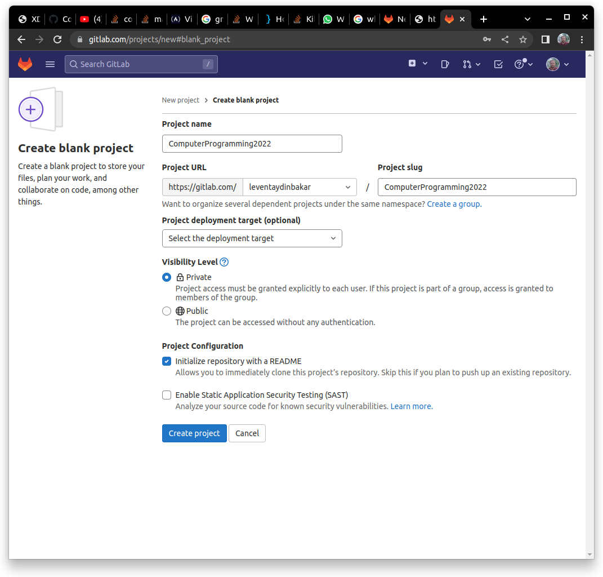

Here you should see your `studentnumber_name_surname` instead of `leventaydinbakar`.

### Add me to your project as a member
Once you create your repository, add me as a member into your project.

Below figure shows how to do it.
1. Open your project page.
1. Click on `Members` under `Project information` (top-left).
1. Click on `Invite members` (top-right). 
1. Write `leventaydinbakar` to find my account and select the one with my picture.
1. Change the `Select a role` to `Owner`.
1. Click `Invite` to finish.

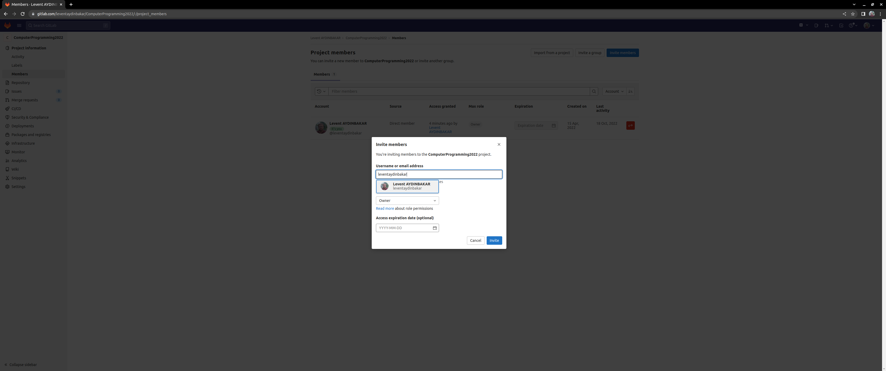

Then I will get an email asking me to accept your invitation.

You will see my name in the list of members when I accept your invitation.

If I do not accept your invitation, check all the steps and try again.

### In your Midterm Exam
we will write a shell script downloading the files you put on GitLab with 
```
https://gitlab.com/STUDENTNUMBER_NAME_SURNAME/ComputerProgramming2022
```

If you make a mistake in your GitLab username which has to be in the form of `STUDENTNUMBER_NAME_SURNAME` or project name which has to be `ComputerProgramming2022`, your files will not be downloaded onto our computers and we may not evaluate you. So be careful at this step.
