# Lecture 5 (04.11.2022)
You can watch the video lectures for
* [1-Python](https://youtu.be/Jqpt3janYkg).

Make a directory so called `Lecture5` and work on it in this lecture. You will push your codes into your GitLab at the end.

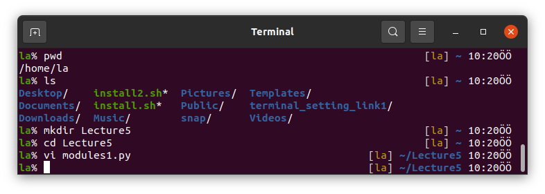

## Running Python in Vim
In the Vim lecture, we mentioned that you can run a terminal command without leaving Vim.
To do this, you can run a command in the command (normal) mode as, for example, `:!ls`.
Python scripts can also be run in Vim by `:!python3 script.py`. 

In Vim, we can make this process automatic and assign a key for this. 
Add the line below into your `~/.vimrc` file.
```bash
nnoremap <f2> :w <CR>:!clear <CR>:!python3 % <CR>
```
Now, press F2 key to run a Python script easily without leaving Vim or typing `:!python3 script.py` every time.

## Python Modules

### `os`
It stands for operating system and provides a way of using operating system dependent functionality in Python.

Some of the useful methods of `os` module are listed below
* `os.getcwd()` prints the current working directory,
* `os.mkdir()` makes an empty directory and prints error if the directory exists,
* `os.makedirs()` makes a directory tree,
* `os.chdir()` changes the current directory,
* `os.listdir()` lists the files and folders in a directory,
* `os.remove()` removes files only (like `rm`),
* `os.rmdir()` removes folders only,
* `os.rename()` renames files and folders,
* `os.path.exists()` prints True or False if the path given exists,
* `os.path.getsize()` prints the size of a directory in bytes.

### `argparse`
Argument parser is used to parse arguments from the commandline to a Python script.

The code block below is written and any argument can be added.

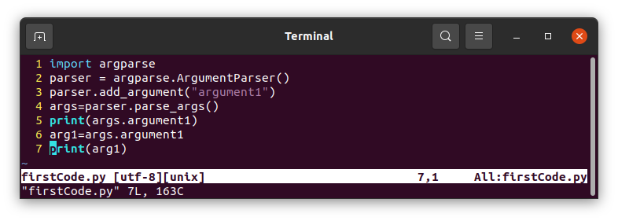
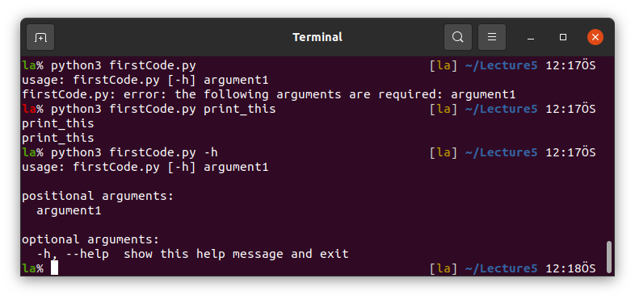

Read integer, float or string.

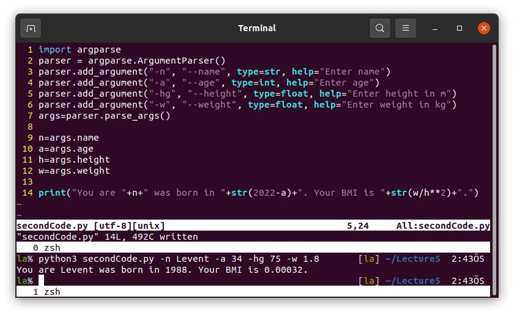

We can also read list items. See the example below.

---
`Example 1:` Write a code calculating the linear velocity of a point located on a rotating model.

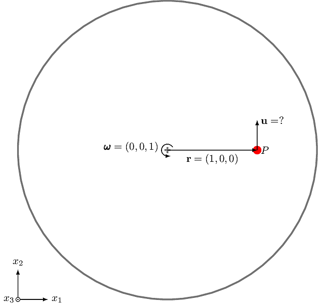

Figure shows the model rotating at $\omega=1~\mathrm{rad/s}$ around $x_3$-axis. Calculate the linear velocity $\mathbf{u}$ of the red point. The position vector from the origin to the point is $\mathbf{r}=(1, 0, 0)$.

`Solution:`

$\mathbf{u}$ is calculated as follows:

```math
\begin{align}
\mathbf{u}=&\pmb\omega \times \mathbf{r}
\\
=& (\omega_2 r_3 - \omega_3 r_2) \mathbf{e}_1 
 - (\omega_1 r_3 - \omega_3 r_1) \mathbf{e}_2 
 + (\omega_1 r_2 - \omega_2 r_1) \mathbf{e}_3
\\
=& \left(
 (\omega_2 r_3 - \omega_3 r_2), 
-(\omega_1 r_3 - \omega_3 r_1), 
 (\omega_1 r_2 - \omega_2 r_1)
\right)
\end{align}
```

where $\omega$ and $r$ with subscripts "1", "2" and "3" are the vector components given by 
$\pmb\omega = \left( \omega\_1, \omega\_2, \omega\_3 \right)$ and 
$\mathbf{r} = \left( r\_1, r\_2, r\_3 \right)$.

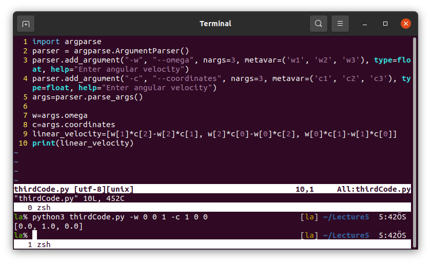

Note that this is not the best way of calculating cross product in Python. 
See NumPy module in the following parts of this lecture.

---

### `math`
Math module is for use of some mathematical functions in Python.
* `math.pi` is $\pi=3.1415...$,
* `math.e` is $e=2.7182...$ (Euler's number),
* `math.sin(angle)` sinus of "angle" in radian,
* `math.cos(angle)` cosinus of "angle" in radian,
* `math.tan(angle)` tangent of "angle" in radian,
* `math.cot(angle)` cotangent of "angle" in radian,
* `math.sqrt(value)` takes the square-root of the "value",
* `math.pow(value, power)` takes the "power" of the "value",
* `math.factorial(value)` takes the factorial,
* `math.isclose(value1, value2, rel_tol=0.1)` prints True or False if "value1" is closer to "value2" than `rel_tol`,
* `math.log(value1, value2)` logaritmic function as $\mathrm{log}\_value1 value2$,
* `math.degrees(radian)` converts "radian" into degrees,
* `math.radians(degree)` converts "degree" into radians,

### `numpy`
NumPy is used for array operations in Python.
For the difference between lists and arrays see figure below.

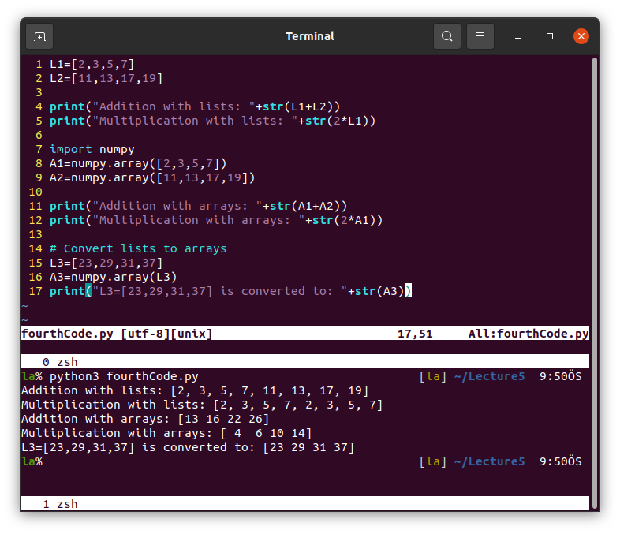

Accessing elements in the lists and arrays.

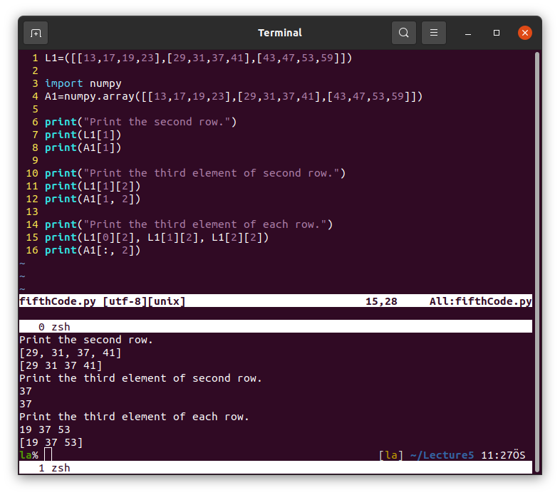

Data types in NumPy.

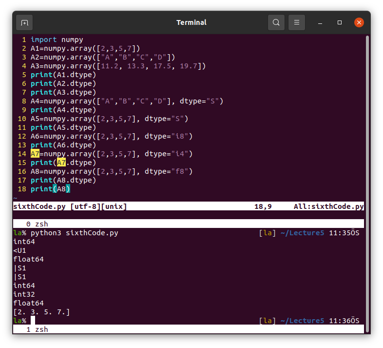

Shape and dimension of an array.

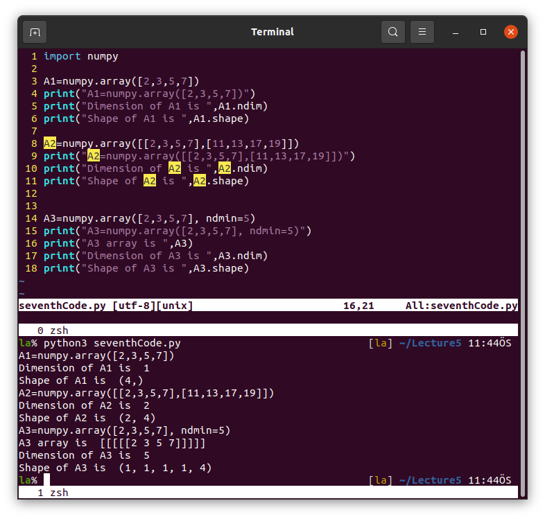

Reshape an array.

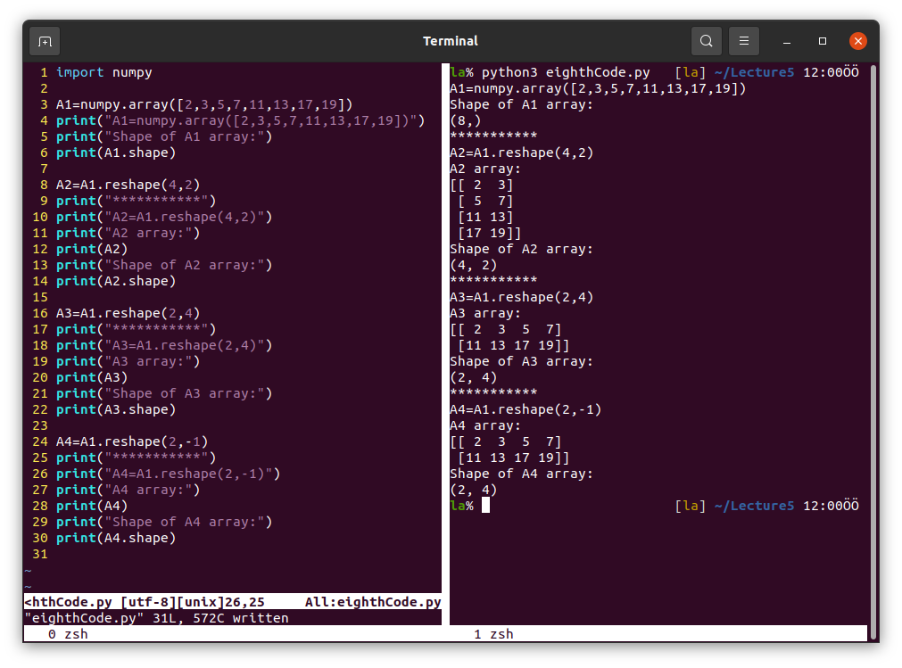

The opposite is also possible.

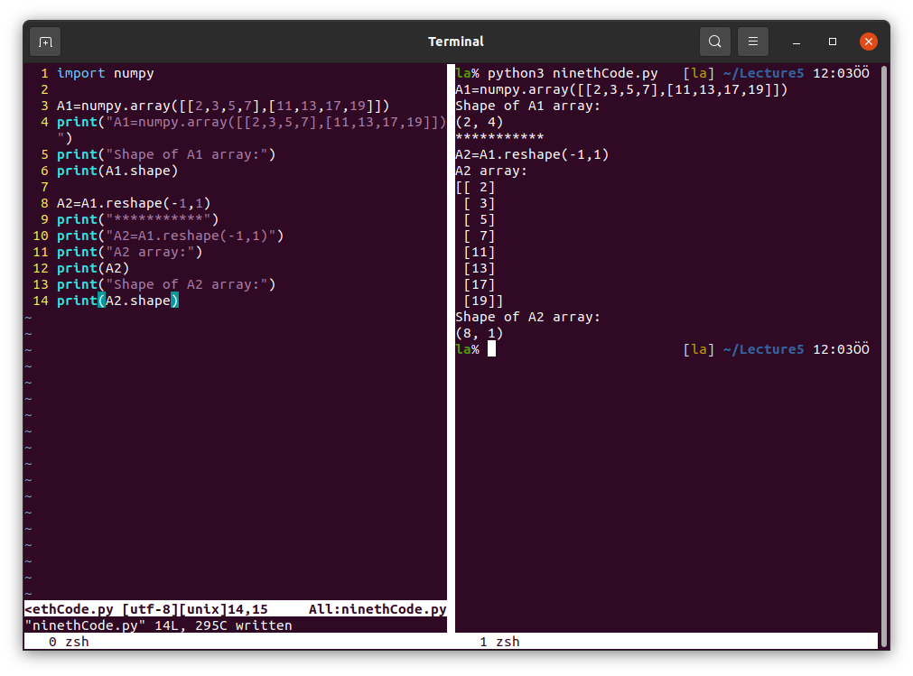

Combining arrays.

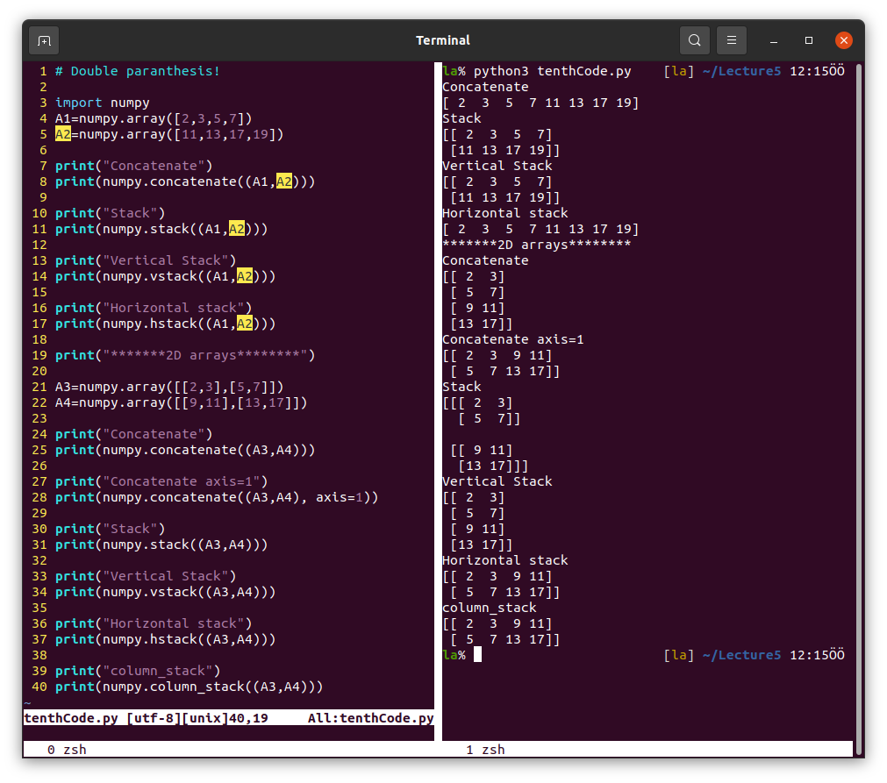

Other methods can be use in NumPy.

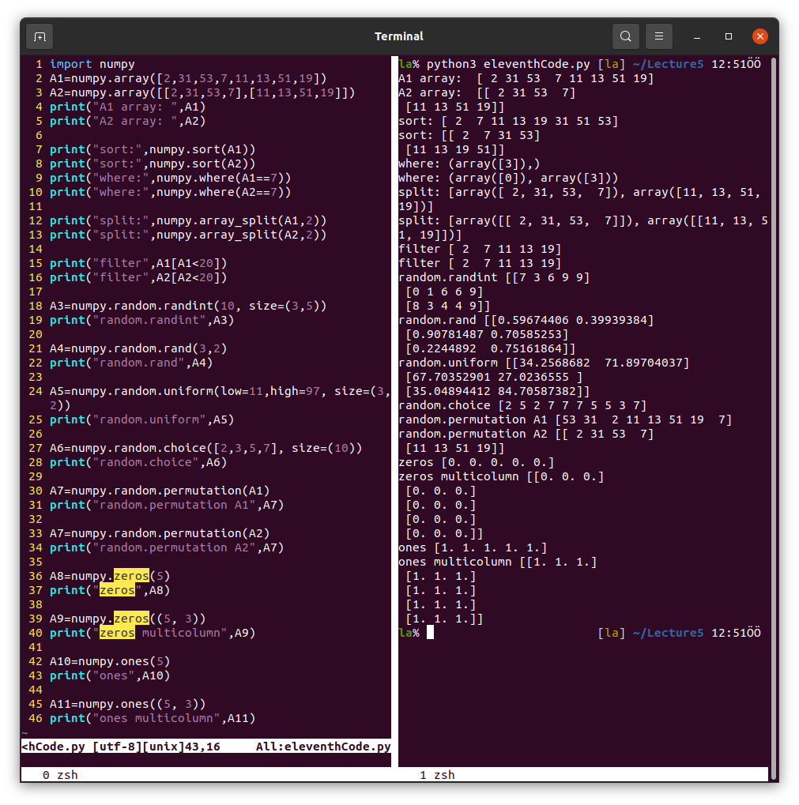

### Reading and writing files
Files can be read or written in Python with/without NumPy.
* `"r"` is used for reading,
* `"w"` is used for creating and writing (overwrite),
* `"a"` is used for creating and appending,


