# Lecture 6 (11.11.2022)
You can watch the video lectures for
* [1-Conditions](https://youtu.be/Zt33uJrWFws).
* [2-Loops](https://youtu.be/gW9rUVL9wNo).
* [3-Write and read files](https://youtu.be/VfFhBzva5J4).

`Clone your files from GitLab`

* You can first remove `ComputerProgramming2022` folder from the lab computer.
* Then download your own repository with `git clone ...` command shown below picture.
* Go to your `ComputerProgramming2022` folder now, and `mkdir Lecture6`.
* Work on the `Lecture6` folder today. Save all the files you make watching the videos above.
* At the end, upload your files onto the GitLab. Follow the commands given in the picture for yourself.

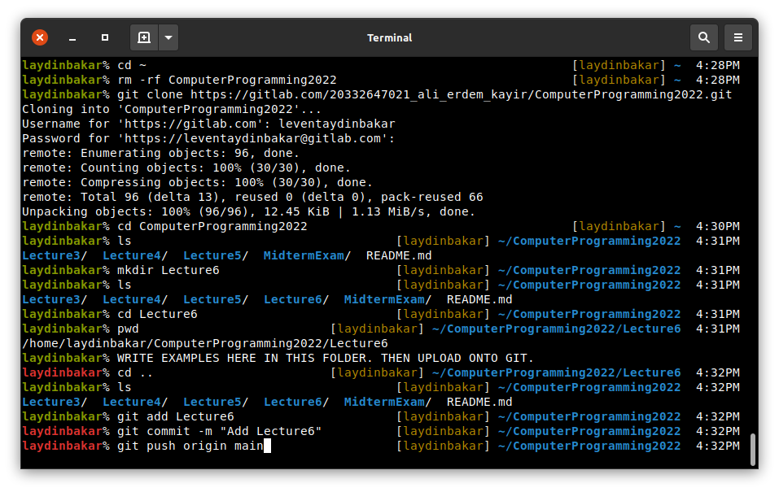

## `if` statement
We can use `if` statement to put conditions for parts of our code in Python.
Logical conditions from math can be used as follows:
* `x == y` is for `x` is equal to `y`,
* `x != y` is for `x` is not equal to `y`,
* `x > y` is for `x` is greater than `y`,
* `x < y` is for `x` is less than `y`,
* `x >= y` is for `x` is greater than or equal to `y`,
* `x <= y` is for `x` is less than or equal to `y`,

An example script printing if variables `X` or `Y` are grater or less than or equal to 10 is below.

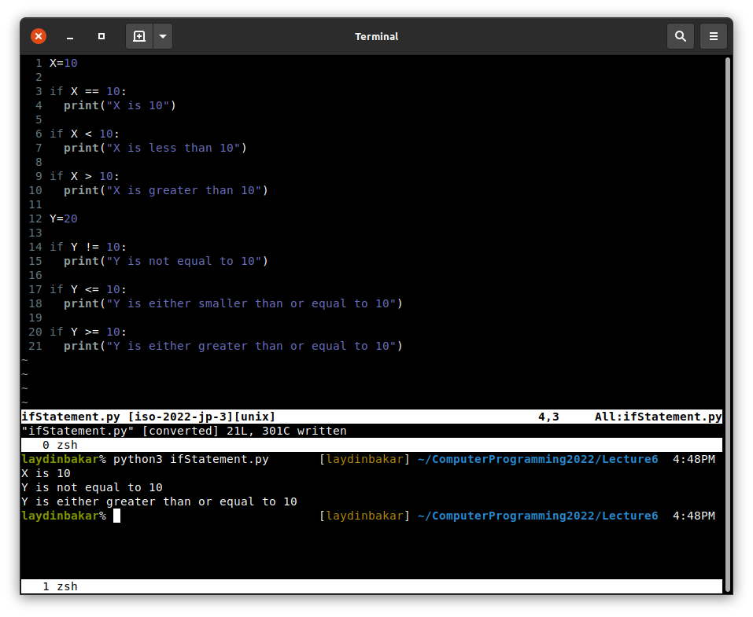

Here the important thing is that we need to put some spaces after the `if` statement line.
 
Two different `if` condition can be used together with/without `and`, `or` and `not`.

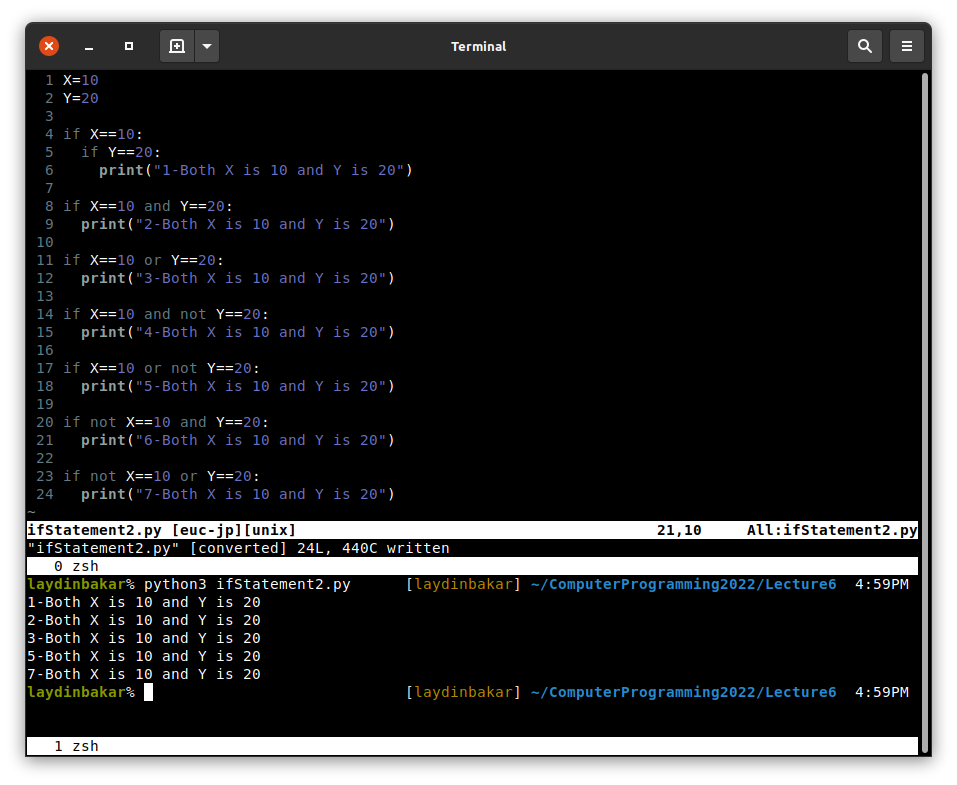

We can use `elif` or `else` as follows:

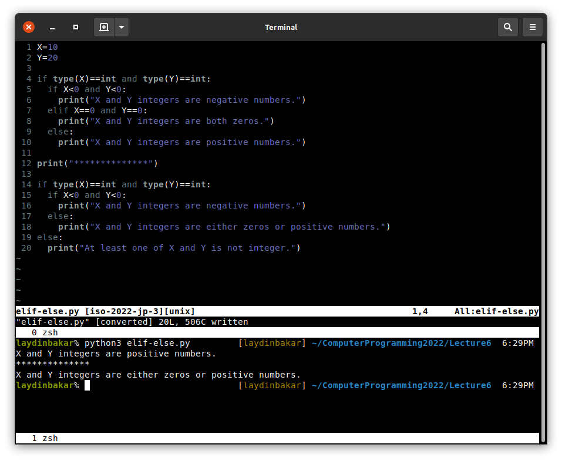

`if` can be used with arguments.

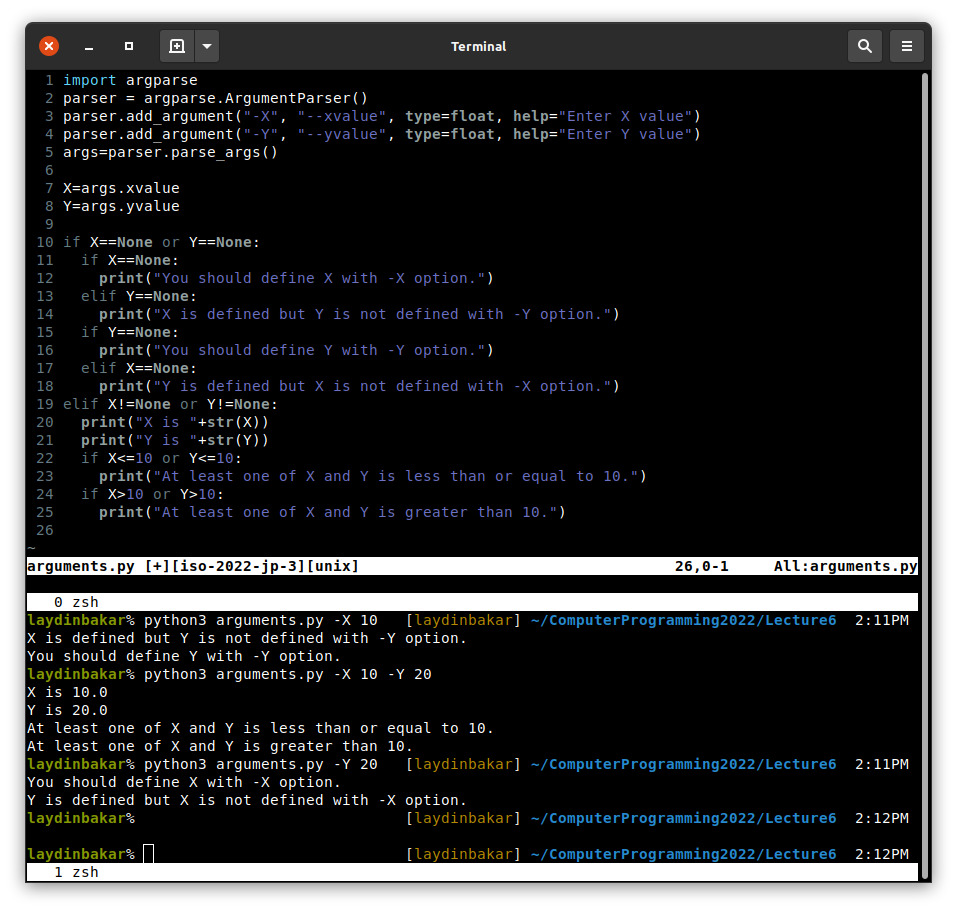

The other argument type `action='store_true'` is quite useful.

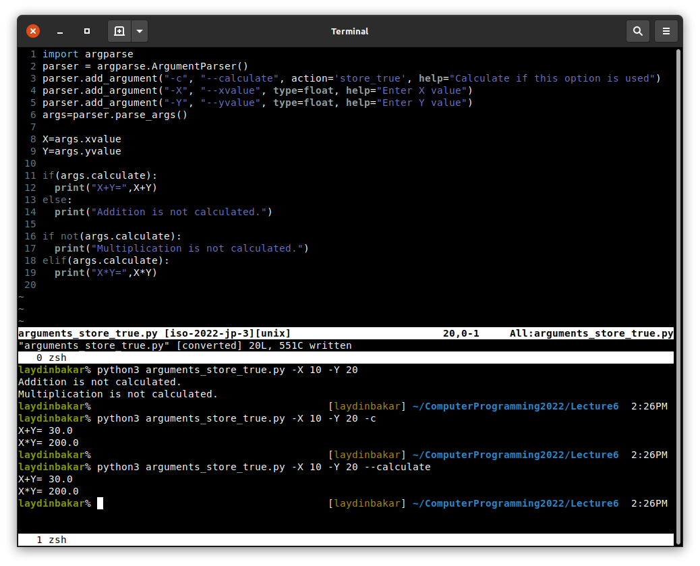

## `for` loop
`for` loop is used for iterating over a sequence. See the script below.

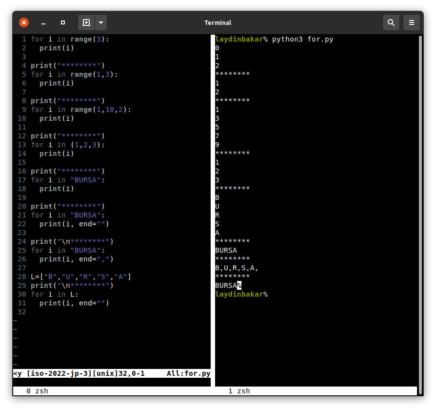

Python can loop in the arrays as follows.

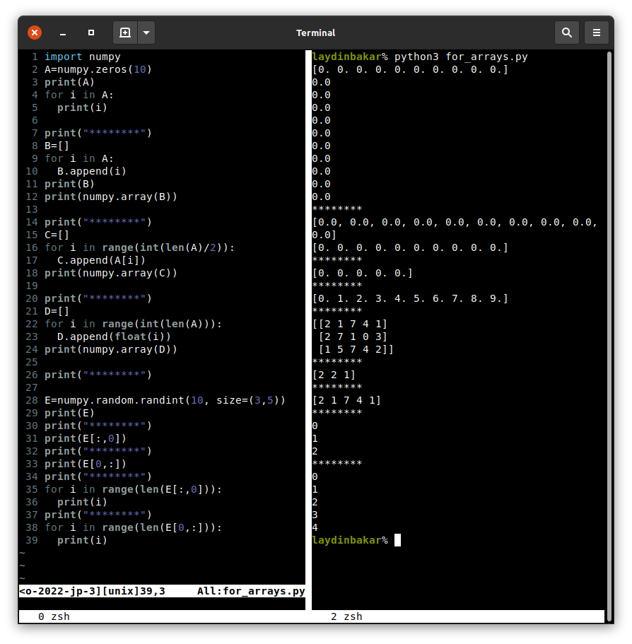

Multiple for loops can be used together.

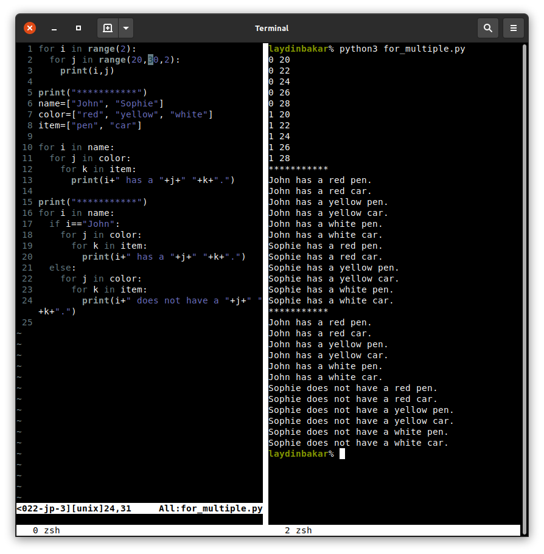

## `while` loop
`while` works as both `for` and `if`. Loop with a condition.

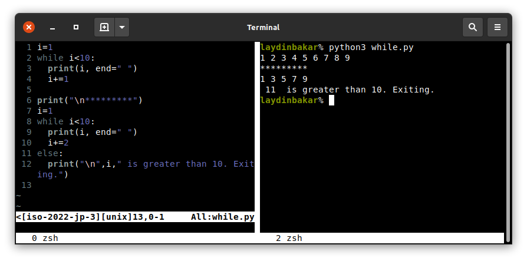

## Writing files in Python
* `"r"` is used for reading,
* `"w"` is used for creating and writing (overwrite),
* `"a"` is used for creating and appending.

We can write strings with `f.write` method:

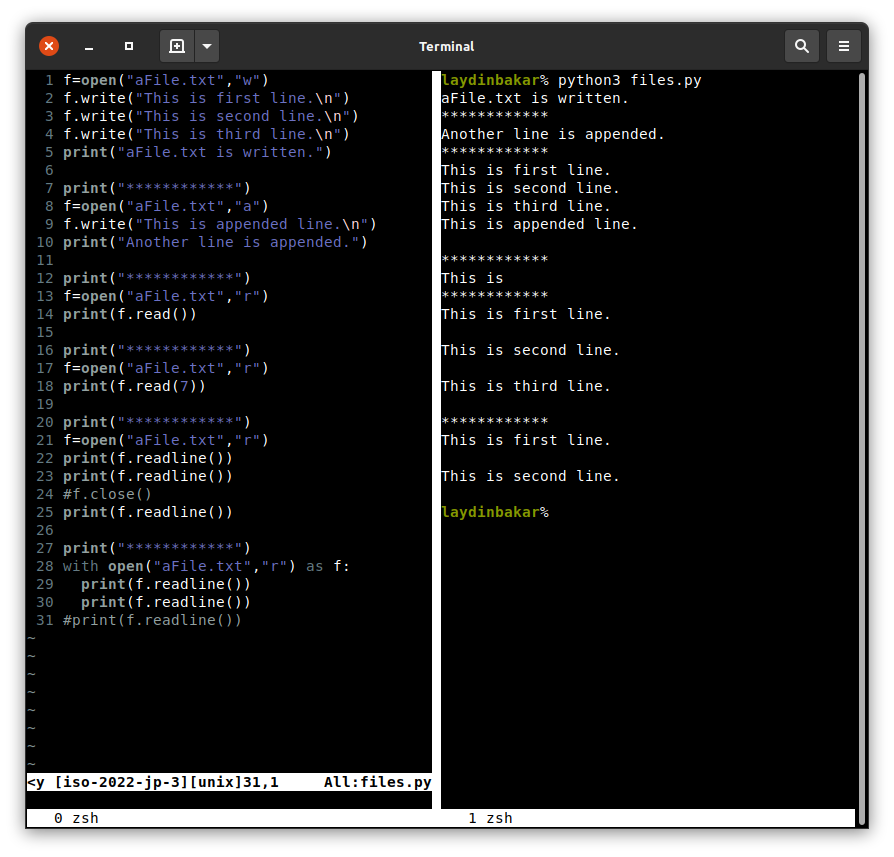

Write arrays into a file using NumPy. Text and binary files.

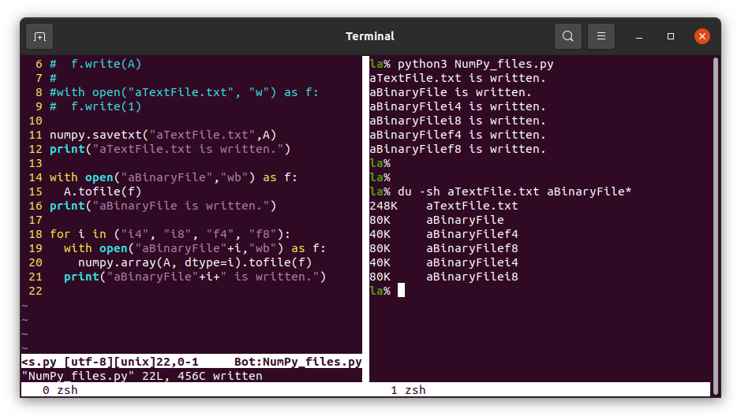

Read binary files.

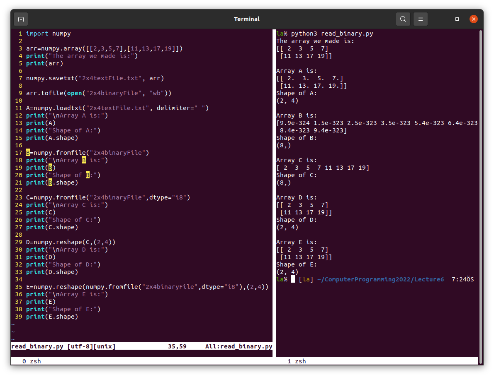

