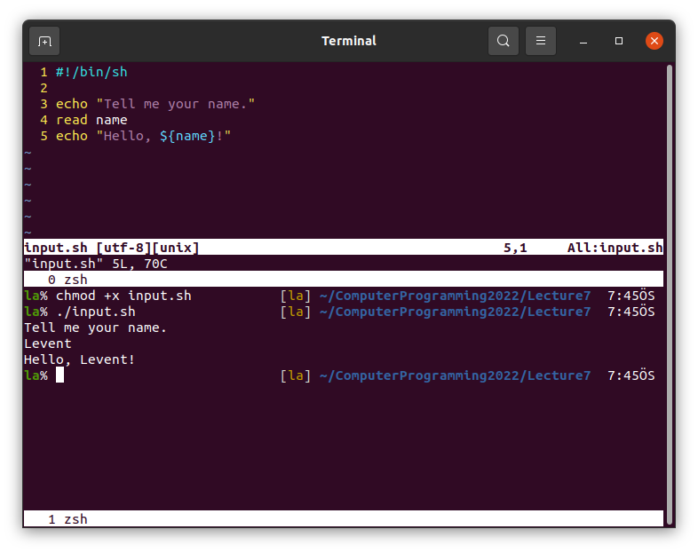

# Lecture 7 (18.11.2022)
You can watch the video lectures on YouTube using the links below.
* [1-Shell scripting](https://youtu.be/MXXKw65xdi0)
* [2-Sed](https://youtu.be/m3LWgdp7lrY)

Again, remove the repositories downloaded onto our lab computers by another student last week first.
```bash
rm -rf ComputerProgramming2022
```

Later, download your GitLab repository to your computer.
```bash
git clone https://gitlab.com/STUDENTID_NAME_SURNAME/ComputerProgramming.git
```

Go to your directory.
```bash
cd ComputerProgramming2022
```

Make a directory so called `Lecture7`, change your working directory, and work on it.
```bash
mkdir -p Lecture7
cd Lecture7
```


**At the end, after making your files** of this lecture instructions below, upload your new files onto GitLab.
```bash
cd /home/btu/ComputerProgramming2022
git add .
git commit -m "Add Lecture7"
git push origin main
```

## Shell scripting
We can run terminal commands in shell scripts. To do our first example, open a file by `vi hello.sh`. `echo` is the print command in the commandline. Hence we can write `echo "Hello World!"` to print something from the shell scitps.

Later run the script with `bash hello.sh` or make the script executable by `chmod +x hello.sh` and just type `./hello.sh` to run it.


We can use most of the terminal commands in a shell script.


A shell script usually starts with `#!/bin/zsh` line to tell Unix this is a shell script.

We can define variables in shell scripts and use those with `$` sign. If something follows when we use the variable name we can use curly brackets. See below example and think on it.


Note that the first line should be `#!/bin/zsh` instead of `#!/bin/sh`.

Input from commandline is also possible in shell scripts.


Note that the first line should be `#!/bin/zsh` instead of `#!/bin/sh`.

We can define some arguments.


Note that the first line should be `#!/bin/zsh` instead of `#!/bin/sh`.

Basic arithmetic operations can be done in shell scripts. 
| Operation | Operation | Option 1 | Option 2 | Option 3 |
| :---: | :---: | :---: | :---: | :---: |
| Addition          | x + y  | `'expr $x + $y'`  | `$(($x+$y))`     | `$(python3 -c "print($x+$y)"`) |
| Substraction      | x - y  | `'expr $x - $y'`  | `$(($x-$y))`     | `$(python3 -c "print($x-$y)"`) |
| Multiplication    | x \* y | `'expr $x \* $y'` | `$(($x\*$y))`    | `$(python3 -c "print($x\*$y)"`) |
| Division          | x / y  | `'expr $x / $y'`  | `$(($x/$y))`     | `$(python3 -c "print($x/$y)"`) |
| Modulus           | x % y  | `'expr $x % $y'`  | `$(($x%$y))`     | `$(python3 -c "print($x%$y)"`) |
Note that expr command is used with back ticks instead of single quotation marks


Note that the first line should be `#!/bin/zsh` instead of `#!/bin/sh`.

Loops can also be used in shell scripts. This might be the most important part considering the aim of the shell scripts.


Conditions are used in shell scripts as follows.


## `sed` command
In Vim, we can search and replace words using `:s/find/replace/g` in entire document. The `s` is actually the `sed` command. We can manipulate files from the commandline using `sed`.

First write a file in the commandline entering the command below.

```bash
cp /dev/null file_line_numbers.txt ; for i in {1..10} ; do echo "This is ${i}th line." >> file_line_numbers.txt ; done
```
This command creates an empty line `file_line_numbers.txt` and writes `This is "number"th line.` in it.

Use `sed` command to change the word `line` with `row` and print.
```bash
sed 's/line/row/g' file_line_numbers.txt
```
This replaces the word `line` with `row` in entire file and prints. 

You can write the output in another file using, for example:
```bash
sed 's/line/row/g' file_line_numbers.txt > file_row_numbers.txt
```

To replace them in the document itself use `-i` option.
```bash
sed -i 's/line/row/g' file_line_numbers.txt
```
This replaces them and overwrites the file.

You can change the nth occurance of a pattern on each lines using, for example try:
```bash
sed 's/is/at/1' file_line_numbers.txt
```
which makes `That is nth row.` and try:
```bash
sed 's/is/at/2' file_line_numbers.txt
```
which makes `This at nth row.`.

You can limit the lines:
```bash
sed '1,3 s/is/at/2' file_line_numbers.txt
```
or in entire document with `/g` at the end:
```bash
sed '1,3 s/is/at/g' file_line_numbers.txt
```
or at a line using a number:
```bash
sed '3 s/is/at/g' file_line_numbers.txt
```

You can (generally in Linux) use special character `/` using `\` before them.
```bash
sed 's/is/\//g' file_line_numbers.txt
```
`...`
You can have a look at [here](https://www.geeksforgeeks.org/sed-command-in-linux-unix-with-examples/) for more examples about the `sed`.
