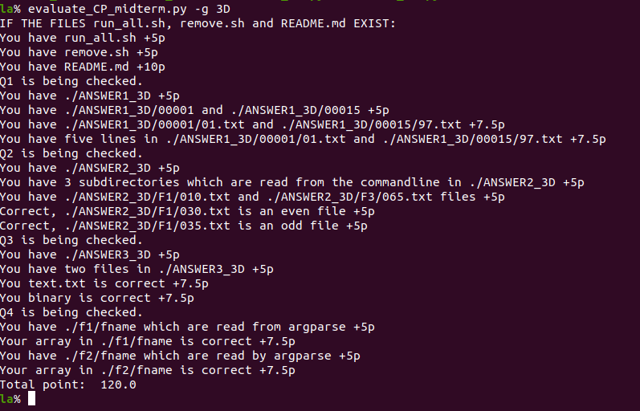

# Lecture 9 (02.12.2022)
## Check your midterm exam
You can check your midterm exam results. Follow the steps:
1. Clone your MidtermExam repository on your computer,
1. go to the folder `MidtermExam`,
1. write [this script](./scripts/evaluate_my_exam.py) into `MidtermExam`,
1. run as `evaluate_my_exam.py -g 1A` where 1A should be your group name.

## Fix your midterm exam

Download [this PDF](./figures/exams.pdf) and find your exam group.

Copy your `MidtermExam` folder to `FixedMidtermExam`. Then fix all the scripts you wrote in the midterm exam.

After you fix all, run the `evaluate_my_exam.py` and see the output below.

Once you add `FixedMidtermExam` folder on your repository correctly, you will get 10 points for your final exam.

Please note that if your fixed results cannot gain exactly 120 points, you will not get the 10 points.

