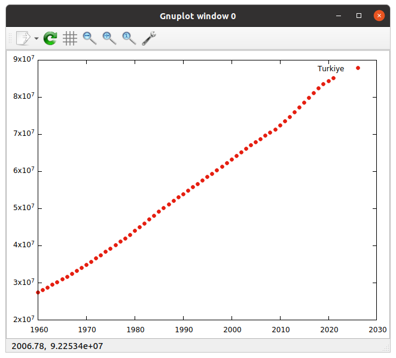
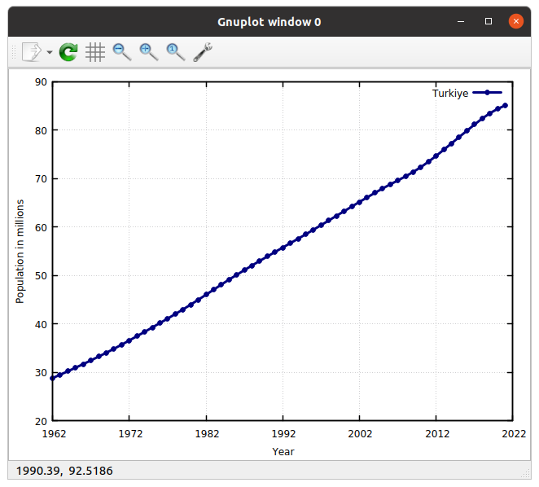
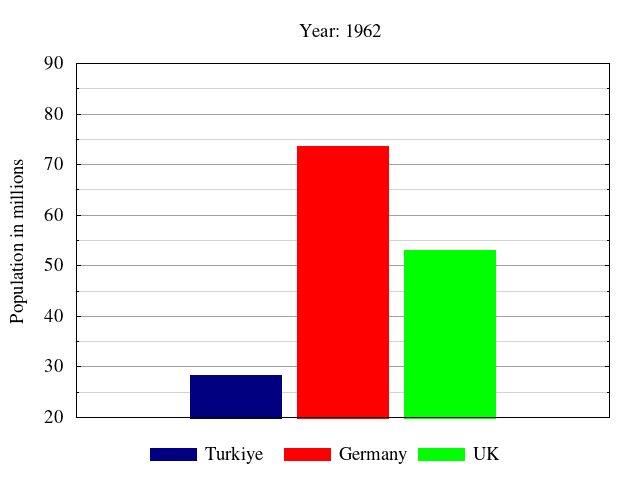

# Lecture 10 (09.12.2022)
## Gnuplot
Gnuplot is a free and open-source commandline driven plotting utility. You can plot high-quality graphs using raw data files or Excel-like program outputs. 

Before starting this tutorial, make `Lecture10` folder, go to that folder and download the data from [here](https://raw.githubusercontent.com/laydinbakar/Computer_Programming_BTU/main/lectures/scripts/population.txt). Right click and click save as. Name it as `population.txt` in `~/Lecture10`.

Type `gnuplot` on a terminal window to start Gnuplot. 

### Plot

The first file we plot is `population.txt`. Run the following command after running Gnuplot on your terminal.

```bash
gnuplot> plot 'population.txt'
```


Here, Gnuplot reads `population.txt` which contains a five-column list. The first column, as default in Gnuplot, is read as the x-axis values of our plot while the second column is y-axis.

We will change the columns later, but you can specify them by `us 1:2`.

```bash
gnuplot> plot 'population.txt' using 1:2
```


### Legend (title)

We can change the legend which seems `'population.txt' us 1:2` on the right-top corner of our graph currently. 
To do this we should use `title` option in Gnuplot as follows:

```bash
gnuplot> plot 'population.txt' using 1:2 title 'Turkiye'
```

All the options in Gnuplot have their short names to save from the typing time. We can get the same result when we run,

```bash
gnuplot> p 'population.txt' us 1:2 t 'Turkiye'
```


### Shape and color options

This `+` sign can be changed with another sign. To check the available signs in Gnuplot we run

```bash
gnuplot> test
```


To change the point type, we can use `linetype` or `lt` and the number we choose.

```bash
gnuplot> p 'population.txt' us 1:2 t 'Turkiye' lt 7
```

Prints the output below.



The color can be set to black by `lc -1`.

```bash
gnuplot> p 'population.txt' us 1:2 t 'Turkiye' lt 7 lc -1
```


Sometimes we may need to use different colors than the default ones. 
Then we can use RGB codes as `lc rgb '#FF9876'` for example.

```bash
gnuplot> p 'population.txt' us 1:2 t 'Turkiye' lt 7 lc rgb '#FF9876'
```


Please see [this](https://www.rapidtables.com/web/color/RGB_Color.html) for more color codes.

Some color names can also be used in a similar format. Use `lc rgb 'navy blue'` for instance.


### Lines

We can use lines using `with lines` or `w l` option.

```bash
gnuplot> p 'population.txt' us 1:2 t 'Turkiye' lt 7 lc rgb 'navy blue' w l
```


Or lines and points together using `with linespoints` or `w lp` option.

```bash
gnuplot> p 'population.txt' us 1:2 t 'Turkiye' lt 7 lc rgb 'navy blue' w lp
```


Line width is changed by `linewidth` or `lw` option. But it should be set before `w lp`.

```bash
gnuplot> p 'population.txt' us 1:2 t 'Turkiye' lt 7 lc rgb 'navy blue' lw 3 w lp
```

### Set ranges of x and y axes

We can change the limits of the axes using 

```bash
gnuplot> set xrange [1962:2022]
``` 

and 

```bash
gnuplot> set yrange [20000000:90000000]
```

Then, you can just run `replot` to update the graph.

```bash
gnuplot> replot
```


### Fix the x-axis tics

When we set the first year to 1962, the x tics seem weird. We can manually set them as follows:

```bash
gnuplot> set xtics (1962,1982,2002,2022)
```

We can use `autofreq 1962,10` to set it starting from 1962 and increasing 10 by 10.

```bash
gnuplot> set xtics autofreq 1962,10
```

Or we can also limit earlier, such as:

```bash
gnuplot> set xtics autoreq 1962,10,1992
```

### Set labels of axes

Similarly, we can use `set xlabel 'Year'` and `set ylabel `Population` for labels.


### Math with data

The y-axis values of our graph are not easy to read for everyone. 
We can divide it to a million by `using 1:($2 / 1000000)` and express it on the label of y-axis as follows:

```bash
gnuplot> p 'population.txt' us 1:($2/1000000) t 'Turkiye' lt 7 lc rgb 'navy blue' lw 3 w lp
gnuplot> set ylabel 'Population in millions'
gnuplot> set yrange [20:90]
```

### Borders

Change the border thickness using,

```bash
gnuplot> set border lw 1.5
```


### Set grid

We can put grids on the graph with the command below.

```bash
gnuplot> set grid
```



If you want to set the grids between the tics, you can use the commands below.

```bash
gnuplot> set grid xtics mxtics
gnuplot> set mxtics 5
gnuplot> set grid ytics mytics
gnuplot> set mytics 2
```


You can also change the grid type from dotted lines to other types.

```bash
gnuplot> set grid lt -1, lt 0
```


Or you can improve it by

```bash
set grid lw 1 lt -1 lc rgb 'gray', lw 1 lt 0 lc rgb 'gray'
```

### Working on scripts

Until this point, we worked on Gnuplot using commandline. But all the setting will disappear when we press `ctrl+d` and exit.

So as to use the same settings on different plots, we can write Gnuplot scripts and use them as template for future works.
Press `ctrl+d` and open a file by `vi template.gp`.

Write the code below.

```bash
#/usr/bin/gnuplot

set xrange [1962:2022]
set yrange [20:90]
set xlabel 'Year'
set ylabel 'Population in millions'
set xtics autofreq 1962,10

set grid xtics lt -1 lw 0.2 lc rgb 'gray'

set grid xtics mxtics
set grid ytics mytics
set mytics 2
set mxtics 5
set grid lw 1 lt -1 lc rgb 'gray', lw 1 lt 0 lc rgb 'gray'

set border lw 1.5 

plot 'population.txt' using 1:($2/1000000) t 'Turkiye' lt 7 lc rgb 'navy blue' lw 3 w lp
```

We can execute this script by,

```bash
gnuplot template.gp -p
```

### Save graph to a file

To save the graph to a file, we first need to define a terminal, and we need to set output.
Add the two lines below on the top of your script.

```bash
set terminal pdfcairo font 'Times,14' size 4.5in,3.0in
set output 'population.pdf'
```

Then, run your script. You should have a PDF document on the same directory at the end. You can open it by `evince population.pdf`.


The default terminal in Gnuplot is `qt` or `wxt` depending on the version. 
When we change the terminal the point sizes and some of other options we set on `qt` change.
To fix it, we can change the point size by adding `ps 0.3` option in the line below.

```bash
plot 'population.txt' using 1:($2/1000000) t 'Turkiye' ps 0.3 lt 7 lc rgb 'navy blue' lw 3 w lp
```

And we can change the grid type by changing the line below.

```bash
set grid lw 1 lt -1 lc rgb 'dark-gray', lw 0.05 lt -1 lc rgb 'light-gray'
```


### Adding multiple lines into the graph

We can add multiple lines into the graph. To do that we can change the line as follows.

```bash
plot 'population.txt' using 1:($2/1000000) t 'Turkiye' ps 0.3 lt 7 lc rgb 'navy blue' lw 3 w lp ,\
'population.txt' using 1:($3/1000000) t 'Germany' ps 0.3 lt 4 lc rgb 'red' lw 3 w lp ,\
'population.txt' using 1:($4/1000000) t 'UK' ps 0.3 lt 8 lc rgb 'green' lw 3 w lp 
```


### Legend position

The legend position can be changed by `set key right bottom` for example. But I prefer locating the legend outside of the graph. Use following to do it.

```bash
set key reverse below Left spacing 2
```


### Multiplots

We can plot the different lines using multiplot method.

```bash
#set key reverse below Left spacing 2
set key bottom right

set multiplot layout 3,1 

unset xlabel
plot 'population.txt' using 1:($2/1000000) t 'Turkiye' ps 0.3 lt 7 lc rgb 'navy blue' lw 3 w lp

unset xlabel
p 'population.txt' using 1:($3/1000000) t 'Germany' ps 0.3 lt 4 lc rgb 'red' lw 3 w lp

set xlabel 'Year'
p 'population.txt' using 1:($4/1000000) t 'UK' ps 0.3 lt 8 lc rgb 'green' lw 3 w lp

unset multiplot
```

Then the output will be as follows:


### Animated GIFs

We can animate the graphs using Gnuplot. To do it we need to change the terminal and use a for loop as shown below.

```bash
#/usr/bin/gnuplot
set terminal gif animate delay 1 font 'Times,14'
set output 'population.gif'

set xrange [1962:2022]
set yrange [20:90]
set xlabel 'Year'
set ylabel 'Population in millions'
set xtics autofreq 1962,10

set grid xtics lt -1 lw 0.2 lc rgb 'gray'

set grid xtics mxtics
set grid ytics mytics
set mytics 2
set mxtics 5
set grid lw 1 lt -1 lc rgb 'dark-gray', lw 0.05 lt -1 lc rgb 'light-gray'

set border lw 1.5 

set key reverse below Left spacing 2

do for [i=1:62]{
plot 'population.txt' using 1:($2/1000000) every ::1::i t 'Turkiye' ps 0.3 lt 7 lc rgb 'navy blue' lw 3 w lp ,\ 
'population.txt' using 1:($3/1000000) every ::1::i t 'Germany' ps 0.3 lt 4 lc rgb 'red' lw 3 w lp ,\ 
'population.txt' using 1:($4/1000000) every ::1::i t 'UK' ps 0.3 lt 8 lc rgb 'green' lw 3 w lp
}
```

Then the output can be watched by `google-chrome population.gif` as follows.


This animation can be done converting the line graph to bar graph as follows:

```bash
#/usr/bin/gnuplot
set terminal gif animate delay 1 font 'Times,14'
set output 'population.gif'

set xrange [1962:2022]
set yrange [20:90]
set xlabel 'Year'
set ylabel 'Population in millions'
set xtics autofreq 1962,10

set grid xtics lt -1 lw 0.2 lc rgb 'gray'

set grid xtics mxtics
set grid ytics mytics
set mytics 2
set mxtics 5
set grid lw 1 lt -1 lc rgb 'dark-gray', lw 0.05 lt -1 lc rgb 'light-gray'

set border lw 1.5 

set key reverse below Left spacing 2

set boxwidth 10
set style fill solid
unset xtics
unset xlabel

do for [i=1:62]{
x=i+1961
set title 'Year: '.x 
plot 'population.txt' using (1980):($2/1000000) every ::i::i t 'Turkiye' ps 0.3 lt 7 lc rgb 'navy blue' lw 3 w boxes ,\
'population.txt' using (1992):($3/1000000) every ::i::i t 'Germany' ps 0.3 lt 4 lc rgb 'red' lw 3 w boxes ,\
'population.txt' using (2004):($4/1000000) every ::i::i t 'UK' ps 0.3 lt 8 lc rgb 'green' lw 3 w boxes 
}
```



### 3D plots

```bash
#/usr/bin/gnuplot
set terminal pdf font 'Times,14' size 4.5in,3in
set output 'population.pdf'

set xyplane 0
set yrange [1962:2022]
set zrange [20:90]
set xrange [1:3]
set ytics autofreq 1962,10

set grid ytics lt -1 lw 0.2 lc rgb 'gray'
set grid xtics lt -1 lw 0.2 lc rgb 'gray'
set grid ztics lt -1 lw 0.2 lc rgb 'gray'

set border lw 1.5 

set xtics ("Turkiye" 1, "Germany" 2, "UK" 3) offset 0,-1

unset key 

splot 'population.txt' using (1):1:($2/1000000) t 'Turkiye' ps 0.3 lt 7 lc rgb 'navy blue' lw 3 w boxes ,\
'population.txt' using (2):1:($3/1000000) t 'Germany' ps 0.3 lt 4 lc rgb 'red' lw 3 w boxes ,\
'population.txt' using (3):1:($4/1000000) t 'UK' ps 0.3 lt 8 lc rgb 'green' lw 3 w boxes
```


