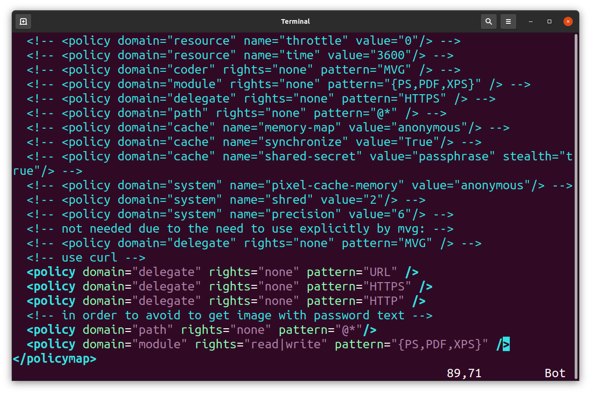

# Lecture 12 (23.12.2022)
## Tikz

You can watch the video lectures on YouTube using [this playlist link](https://www.youtube.com/playlist?list=PLxJ7zqe9IspKF7F07-6aZEaFpoMZzSZel) or the links below.

* [1-Introduction to Tikz](https://youtu.be/04OXOEXTtO8)
* [2-Shapes and colors](https://youtu.be/ovDJ3vkcwl4)
* [3-Arrows and nodes](https://youtu.be/YvzRjy94Krw)
* [4-For loops](https://youtu.be/QZSd6p0wA0c)
* [5-Animations](https://youtu.be/ULSLQMGX7Xw)
* [6-Example sketch](https://youtu.be/ioIibNszUNk)

## Tikz
Tikz is a package in LaTeX to draw professional-looking drawings.

### Import package
We need to import Tikz package first.
```latex
\usepackage{tikz}
```
We can either make our drawings in our LaTeX documents directly or we can make the drawings outside of the documents and import to LaTeX as PDF files using `includegraphics` function.

To make the drawings outside an appropriate document class is `standalone`. We can open it as follows.
```latex
\documentclass[tikz, margin=2mm]{standalone}
```

In this tutorial, the drawings will be made in the LaTeX documents.

We can draw simple shapes as follows:
### Lines
```latex
\documentclass{article}
\usepackage{tikz}

\begin{document}
\begin{figure}
\begin{tikzpicture}

\draw (0,0) -- (4,0);

\end{tikzpicture}
\end{figure}
\end{document}
```

### Rectangles
```latex
\documentclass{article}
\usepackage{tikz}

\begin{document}
\begin{figure}
\begin{tikzpicture}

\draw (0,0) rectangle (4,2);

\end{tikzpicture}
\end{figure}
\end{document}
```

### Circles
```latex
\documentclass{article}
\usepackage{tikz}

\begin{document}
\begin{figure}
\begin{tikzpicture}

\draw (0,0) circle (4cm);

\end{tikzpicture}
\end{figure}
\end{document}
```

### Ellipses
```latex
\documentclass{article}
\usepackage{tikz}

\begin{document}
\begin{figure}
\begin{tikzpicture}

\draw (0,0) ellipse (4cm and 2cm);

\end{tikzpicture}
\end{figure}
\end{document}
```

### B-splines
```latex
\documentclass{article}
\usepackage{tikz}

\begin{document}
\begin{figure}
\begin{tikzpicture}

\draw (0,0) .. controls (1,-1) and (2,1) .. (3,0);

\end{tikzpicture}
\end{figure}
\end{document}
```

### Line shape and colors
```latex
\documentclass{article}
\usepackage{tikz}
\usepackage{xcolor}

\begin{figure}[ht]
\centering
\begin{tikzpicture}
\draw[line width=1pt, brown!50!yellow] (5,0) ellipse (2cm and 3cm);
\draw[line width=2pt, black!53!blue!90!white, dotted] (0,0) ellipse (3cm and 2cm);
\end{tikzpicture}
\end{figure}
\end{document}
```

### Arrows
```latex
\documentclass{article}
\usepackage{tikz}
\usepackage{xcolor}

\begin{figure}[ht]
\centering
\begin{tikzpicture}
\draw[->] (0,0) -- (6,0);
\draw[-latex] (0,-2) -- (6,-2);
\draw[-stealth] (0,-4) -- (6,-4);
\end{tikzpicture}
\end{figure}
\end{document}
```

### Nodes
```latex
\documentclass{article}
\usepackage{tikz}
\usepackage{xcolor}

\begin{figure}[ht]
\centering
\begin{tikzpicture}
\draw[-latex] (0,0) -- (6,0) node[right]{$x_1$};
\draw[-latex] (0,0) -- (0,6) node[above]{$x_2$};
\end{tikzpicture}
\end{figure}
\end{document}
```

### Define variables
```latex
\documentclass{article}
\usepackage{tikz}
\usepackage{xcolor}

\begin{figure}[ht]
\centering
\begin{tikzpicture}
\draw[-latex] (0,0) -- (6,0) node[right]{$x_1$};
\draw[-latex] (0,0) -- (0,6) node[above]{$x_2$};
\def\x{-0.4}
\def\y{-0.4}
\node at (\x,\y) {$(0,0)$};
\node at ( 1.0,\y) {$1$};
\node at ( 2.0,\y) {$2$};
\node at ( 3.0,\y) {$3$};
\node at ( 4.0,\y) {$4$};
\node at ( 5.0,\y) {$5$};
\draw (1,0.1) -- (1,-0.1);
\draw (2,0.1) -- (2,-0.1);
\draw (3,0.1) -- (3,-0.1);
\draw (4,0.1) -- (4,-0.1);
\draw (5,0.1) -- (5,-0.1);
\end{tikzpicture}
\end{figure}
\end{document}
```

### For loops with `foreach` function
```latex
\documentclass{article}
\usepackage{tikz}
\usepackage{xcolor}

\begin{figure}[ht]
\centering
\begin{tikzpicture}
\draw[-latex] (0,0) -- (6,0) node[right]{$x_1$};
\draw[-latex] (0,0) -- (0,6) node[above]{$x_2$};
\def\x{-0.4}
\def\y{-0.4}
\node at (\x,\y) {$(0,0)$};
\node at ( 1.0,\y) {$1$};
\node at ( 2.0,\y) {$2$};
\node at ( 3.0,\y) {$3$};
\node at ( 4.0,\y) {$4$};
\node at ( 5.0,\y) {$5$};
\draw (1,0.1) -- (1,-0.1);
\draw (2,0.1) -- (2,-0.1);
\draw (3,0.1) -- (3,-0.1);
\draw (4,0.1) -- (4,-0.1);
\draw (5,0.1) -- (5,-0.1);

\foreach \y in {1,2,3,4,5}
\node at (\x, \y) {$\y$};
\foreach \y in {1,2,3,4,5}
\draw (0.1,\y) -- (-0.1,\y);
\end{tikzpicture}
\end{figure}

\begin{figure}[ht]
\centering
\begin{tikzpicture}
\foreach \y in {-3,-2,-1,0,1,2,3,4,5,6}
  \draw (1,\y) -- (-1,\y);
\end{tikzpicture}
\caption{These are lines (foreach)}
\end{figure}

\begin{figure}[ht]
\centering
\begin{tikzpicture}
\foreach \y in {-3,-2,-1,0,1,2,3,4,5,6}
  \draw ( 1,\y) -- (-1,\y); 
\foreach \y in {-3,-2,-1,0,1,2,3,4,5,6}
  \node at (0,\y+0.2) {$\y$};
\end{tikzpicture}
\caption{These are lines with numbers}
\end{figure}

\end{document}
```

### Grid lines
```latex
\documentclass{article}
\usepackage{tikz}
\usepackage{xcolor}

\begin{figure}[ht]
\centering
\begin{tikzpicture}
%\draw[step=0.1cm, gray!50!white, line width=0.5pt] (-3,-3) grid (6,6);
%\draw[step=1cm, gray, line width=0.5pt] (-3,-3) grid (6,6);
%\foreach \y in {-3,-2,-1,0,1,2,3,4,5,6}
%  \draw (1pt,\y cm) -- (-1pt,\y cm) node[anchor=east] {$\y$};
%\foreach \x in {-3,-2,-1,0,1,2,3,4,5,6}
%  \draw (\x cm,1pt) -- (\x cm,-1pt) node[anchor=north] {$\x$};
\draw[fill=red] (2.2,2.2) circle (1mm);
\draw[fill=black] (-2.2,-2.2) circle (1mm);
\draw[line width=1pt, brown!50!yellow] (0,0) ellipse (2cm and 3cm);
\end{tikzpicture}
\caption{This is a grid}
\end{figure}
\end{document}
```

### An example document

```latex
\documentclass{article}
%\documentclass{standalone}
\usepackage{tikz}
\usepackage{xcolor}

\begin{document}

\begin{figure}[h]
\begin{center}
\begin{tikzpicture}
\draw (0.0, 0.0) 
-- (3.5, 0.0) 
-- (3.5, 2.0) 
-- (4.5, 2.0) 
-- (4.5, 4.0) 
-- (3.5, 4.0) 
-- (3.5, 5.0) 
-- (3.0, 5.0)  
-- (3.0, 0.5) 
-- (0.5, 0.5) 
-- (0.5, 5.0) 
-- (0.0, 5.0) 
-- (0.0, 0.0) 
;
\draw (3.5, 2.5) rectangle (4.0, 3.5);
\end{tikzpicture}
\caption{Schematic of the heat transfer problem. Geometry}
\label{fig:problem}
\end{center}
\end{figure}

Schematic of the heat transfer probelm is shown in Figure~\ref{fig:problem}.

\begin{figure}[h]
\begin{center}
\begin{tikzpicture}
\draw (0.0, 0.0) 
-- (3.5, 0.0) 
-- (3.5, 2.0) 
-- (4.5, 2.0) 
-- (4.5, 4.0) 
-- (3.5, 4.0) 
-- (3.5, 5.0) 
-- (3.0, 5.0)  
-- (3.0, 0.5) 
-- (0.5, 0.5) 
-- (0.5, 5.0) 
-- (0.0, 5.0) 
-- (0.0, 0.0) 
;
\draw (3.5, 2.5) rectangle (4.0, 3.5);
\draw[latex-latex] ( 0.0,-0.1) -- ( 3.5,-0.1);
\draw[latex-latex] ( 3.6, 0.0) -- ( 3.6, 2.0);
\draw[latex-latex] ( 4.6, 2.0) -- ( 4.6, 4.0);
\draw[latex-latex] ( 4.1, 2.5) -- ( 4.1, 3.5);
\draw[latex-latex] (-0.1, 0.0) -- (-0.1, 5.0);
\draw[latex-latex] ( 0.0, 5.1) -- ( 0.5, 5.1);
\draw[latex-latex] ( 0.0, 5.1) -- ( 0.5, 5.1);
\draw[latex-latex] ( 3.5, 4.1) -- ( 4.5, 4.1);
\draw[latex-latex] ( 3.5, 3.6) -- ( 4.0, 3.6);
\end{tikzpicture}
\caption{Schematic of the heat transfer problem. Arrows}
\label{fig:problem_geo}
\end{center}
\end{figure}

\begin{figure}[h]
\begin{center}
\begin{tikzpicture}
\draw (0.0, 0.0) 
-- (3.5, 0.0) 
-- (3.5, 2.0) 
-- (4.5, 2.0) 
-- (4.5, 4.0) 
-- (3.5, 4.0) 
-- (3.5, 5.0) 
-- (3.0, 5.0)  
-- (3.0, 0.5) 
-- (0.5, 0.5) 
-- (0.5, 5.0) 
-- (0.0, 5.0) 
-- (0.0, 0.0) 
;
\draw (3.5, 2.5) rectangle (4.0, 3.5);
\draw[latex-latex] ( 0.0,-0.1) -- ( 3.5,-0.1) node[below, midway]{$35$};
\draw[latex-latex] ( 3.6, 0.0) -- ( 3.6, 2.0) node[right, midway]{$20$};
\draw[latex-latex] ( 4.6, 2.0) -- ( 4.6, 4.0) node[right, midway]{$20$};
\draw[latex-latex] ( 4.1, 2.5) -- ( 4.1, 3.5) node[right, midway, inner sep=0mm]{$10$};
\draw[latex-latex] (-0.1, 0.0) -- (-0.1, 5.0) node[left, midway]{$50$};
\draw[latex-latex] ( 0.0, 5.1) -- ( 0.5, 5.1) node[above, midway]{$5$};
\draw[latex-latex] ( 3.5, 4.1) -- ( 4.5, 4.1) node[above, midway]{$10$};
\draw[latex-latex] ( 3.5, 3.6) -- ( 4.0, 3.6) node[above, midway]{$5$};
\end{tikzpicture}
\caption{Schematic of the heat transfer problem. Sizes}
\label{fig:problem_geo_with_numbers}
\end{center}
\end{figure}

\begin{figure}[h]
\begin{center}
\begin{tikzpicture}
\draw[blue!10!white, fill=blue!10!white] (0.5, 0.5) rectangle (3.0, 5.0);
\node at (1.75,4.5) {Water};
\node at (1.75,4.0) {$89^\circ\mathrm{C}$};
\node at (1.75,5.6) {Room temp.: $22^\circ\mathrm{C}$};
\draw (0.0, 0.0) 
-- (3.5, 0.0) 
-- (3.5, 2.0) 
-- (4.5, 2.0) 
-- (4.5, 4.0) 
-- (3.5, 4.0) 
-- (3.5, 5.0) 
-- (3.0, 5.0)  
-- (3.0, 0.5) 
-- (0.5, 0.5) 
-- (0.5, 5.0) 
-- (0.0, 5.0) 
-- (0.0, 0.0) 
;
\draw (3.5, 2.5) rectangle (4.0, 3.5);
\draw[latex-latex] ( 0.0,-0.1) -- ( 3.5,-0.1) node[below, midway]{$35$};
\draw[latex-latex] ( 3.6, 0.0) -- ( 3.6, 2.0) node[right, midway]{$20$};
\draw[latex-latex] ( 4.6, 2.0) -- ( 4.6, 4.0) node[right, midway]{$20$};
\draw[latex-latex] ( 4.1, 2.5) -- ( 4.1, 3.5) node[right, midway, inner sep=0mm]{$10$};
\draw[latex-latex] (-0.1, 0.0) -- (-0.1, 5.0) node[left, midway]{$50$};
\draw[latex-latex] ( 0.0, 5.1) -- ( 0.5, 5.1) node[above, midway]{$5$};
\draw[latex-latex] ( 3.5, 4.1) -- ( 4.5, 4.1) node[above, midway]{$10$};
\draw[latex-latex] ( 3.5, 3.6) -- ( 4.0, 3.6) node[above, midway]{$5$};
\end{tikzpicture}
\caption{Schematic of the heat transfer problem. Water}
\label{fig:problem_geo_with_numbers}
\end{center}
\end{figure}

\end{document}
```

### Animations
```latex
\documentclass[tikz,margin=2mm]{standalone}
\usepackage{tikz}

\begin{document}

\foreach \x in {0,1,...,60,59,58,...,0}{
\begin{tikzpicture}

\draw[line width=1.5pt, blue!30!black, fill=white] (0,0) rectangle (6,4);
\draw[line width=0.5pt, red] (0,0) rectangle (\x/10,4);
\draw[line width=1.5pt, blue!30!black] (0,0) rectangle (6,4);
  
\end{tikzpicture}
}

\end{document}
```

#### Convert command possible error
You need to install imagemagick to use `convert` command to convert PDF to GIF.
```
sudo apt-get update
sudo apt-get install imagemagick
```
Then refresh your terminal.

If you get an error similar to
```
attempt to perform an operation not allowed by the security policy `PDF'
```
you need to follow below.
```bash
sudo vi /etc/ImageMagick-6/policy.xml
```
paste the line below just above `</policymap>` line:
```bash
<policy domain="module" rights="read|write" pattern="{PS,PDF,XPS}" /
```
You `policy.xmf` file should look like:


